Validation and survival analysis HLA-II^CONST signature
================
Mario Presti
First created on November 2024 Updated on 02 July 2026

- [SIGNATURE CREATION](#signature-creation)
  - [Comparison with other
    signatures](#comparison-with-other-signatures)
- [VALIDATION](#validation)
  - [Get in House biopsy data](#get-in-house-biopsy-data)
  - [Compare biopsy signature score with TCL HLA-II
    expression](#compare-biopsy-signature-score-with-tcl-hla-ii-expression)
- [SURVIVAL ANALYSIS](#survival-analysis)
- [GDC data preparation](#gdc-data-preparation)
- [Administrative censoring at 15
  years](#administrative-censoring-at-15-years)
- [Univariate analysis on TCGA-SKCM](#univariate-analysis-on-tcga-skcm)
  - [Subgroup analysis on the few ICI treated patients in TCGA
    data](#subgroup-analysis-on-the-few-ici-treated-patients-in-tcga-data)
  - [Subgroup analysis on all the patients who ever received
    immunotherapy](#subgroup-analysis-on-all-the-patients-who-ever-received-immunotherapy)
  - [Prognostic vs predictive role of the
    signature](#prognostic-vs-predictive-role-of-the-signature)
- [Multivariate analysis on
  TCGA-SKCM](#multivariate-analysis-on-tcga-skcm)
  - [Calculate Immune infiltration with
    ESTIMATE](#calculate-immune-infiltration-with-estimate)
    - [Sensitivity: Fit signature score as a continuous
      covariate](#sensitivity-fit-signature-score-as-a-continuous-covariate)
    - [Multivariate with dichotomized
      cohort](#multivariate-with-dichotomized-cohort)
  - [Association with TMB](#association-with-tmb)
  - [Baseline characteristics according to HLA
    group](#baseline-characteristics-according-to-hla-group)
  - [Larger multivariate model (immune infiltration, CIITA, and single
    HLA-II
    isotypes)](#larger-multivariate-model-immune-infiltration-ciita-and-single-hla-ii-isotypes)
  - [Compare the different models (Exploratory, not
    included)](#compare-the-different-models-exploratory-not-included)
  - [Compare different HLA-II
    isotypes](#compare-different-hla-ii-isotypes)
- [DE between HLA-II groups in TCGA](#de-between-hla-ii-groups-in-tcga)
  - [DE](#de)
  - [GSEA](#gsea)
- [Test dedifferentiation status vs signature in TCGA-SKCM (Exploratory,
  not
  included)](#test-dedifferentiation-status-vs-signature-in-tcga-skcm-exploratory-not-included)
  - [Multivariate model with Tsoi
    states](#multivariate-model-with-tsoi-states)
- [Exploratory analyses on TIL
  Cohort](#exploratory-analyses-on-til-cohort)
  - [Univariate analysis](#univariate-analysis)
- [HLA-IICONST and response correlation in TIL (Exploratory, not
  included)](#hla-iiconst-and-response-correlation-in-til-exploratory-not-included)
- [TCR changes in HLA-high vs HLA-low (Exploratory, not
  included)](#tcr-changes-in-hla-high-vs-hla-low-exploratory-not-included)

# SIGNATURE CREATION

With the top/bottom 20 genes, a gene signature was created to
investigate survival in TCGA patient. Of note: baseMean above 3000 was
chosen as a cutoff as we wanted to use highly expressed genes to
investigate tumor biopsies, T cell and immune-related genes were
excluded from the signature as in Gokuldass et al, Cancer Immunol
Immunoth. 2022 \#create signature

``` r
#Retrieve DEG genes in HLA high
HLA_DR_genes <- grep("^HLA-DR", rownames(combined_dds), value = T)
HLA_DP_genes <- grep("^HLA-DP", rownames(combined_dds), value = T)
HLA_DQ_genes <- grep("^HLA-DQ", rownames(combined_dds), value = T)
HLAII_genes <- unique(c("CIITA", HLA_DR_genes, HLA_DP_genes, HLA_DQ_genes))

combined_results_filter_less_strict <- as.data.frame(results(combined_dds, name = "KNN_cluster_HLA_high_vs_HLA_low",cooksCutoff = T)) %>% 
  dplyr::filter(padj < 0.01 & baseMean >30 & abs(log2FoldChange) > 1.5)
combined_results_filter_less_strict$gene <- rownames(combined_results_filter_less_strict)


immunological_dataset <- read.table("../public/immunological_gene_lists.txt", header = F, sep = "\t",fill = T)
immunological_dataset <- subset(immunological_dataset, V3 == "GO")

# ensembl <- useEnsembl("ensembl", dataset = "hsapiens_gene_ensembl")
load("../controlled_data/ensembl.RData") #saved it to ensure it works when ensembl is down
# 2. Get all genes annotated to immune GO terms
go_terms <- immunological_dataset$V2

immune_anno <- getBM(
  attributes = c("hgnc_symbol", "go_id"),  # or "hgnc_symbol"
  filters    = "go",                              # correct filter name
  values     = go_terms,
  mart       = ensembl
)


immune_genes <- unique(immune_anno$hgnc_symbol)

# 3. Filter your own list
my_genes       <- combined_results_filter_less_strict$gene
filtered_genes <- setdiff(my_genes, immune_genes)

combined_results_filter_no_immune <- subset(combined_results_filter_less_strict, gene %in% filtered_genes)

# top 15 up
up15 <- combined_results_filter_no_immune %>%
  dplyr::filter(baseMean > 800 & log2FoldChange > 2.5) %>%
 top_n(15, wt = log2FoldChange)

# top 15 *down* (note the negative n)
down15 <- combined_results_filter_no_immune %>%
  dplyr::filter(baseMean > 800 & log2FoldChange < -2.5) %>%
  top_n(-30, wt = log2FoldChange)

# combine
gene_signature <- dplyr::bind_rows(up15, down15) %>%
  dplyr::arrange(desc(log2FoldChange))
gene_signature
```

    ##           baseMean log2FoldChange     lfcSE      stat        pvalue
    ## CIITA    1156.1108       5.494581 0.2299722 23.892367 3.676746e-126
    ## NGFR     7990.0787       4.868019 0.4456373 10.923724  8.877954e-28
    ## SLITRK6   824.9376       3.924052 0.4750988  8.259444  1.463520e-16
    ## CADM3    1133.7551       3.845668 0.6441132  5.970485  2.365489e-09
    ## ACAN     2074.5640       3.819303 0.5863569  6.513615  7.336333e-11
    ## CD36     3855.4262       3.677712 0.6356535  5.785718  7.220307e-09
    ## ST8SIA5   965.6271       3.512196 0.5756835  6.100916  1.054626e-09
    ## SULF1    2266.8119       3.386451 0.6423118  5.272284  1.347361e-07
    ## TRAF1    2047.2609       3.297906 0.3924534  8.403307  4.340762e-17
    ## COL22A1  1417.3751       2.823963 0.5856088  4.822268  1.419349e-06
    ## TCN1     1169.4301       2.782443 0.4942713  5.629384  1.808549e-08
    ## GPC6     1435.0912       2.742735 0.4477236  6.125956  9.014062e-10
    ## TMEM47   1185.3538       2.721580 0.5024668  5.416438  6.079821e-08
    ## FLRT3    1311.0025       2.703846 0.3846513  7.029343  2.075076e-12
    ## MPZ      3619.2090       2.664993 0.4834834  5.512067  3.546440e-08
    ## NR4A3    1375.1200      -2.627522 0.4095466 -6.415686  1.401905e-10
    ## FLNC     2138.3375      -2.628914 0.5084866 -5.170075  2.339995e-07
    ## ITGA7    1796.6941      -2.671621 0.3576161 -7.470639  7.980655e-14
    ## OCA2     1387.7757      -2.740506 0.6560589 -4.177226  2.950858e-05
    ## PLAU     1805.2075      -2.742515 0.6289124 -4.360726  1.296314e-05
    ## COL6A3   4465.6962      -2.747046 0.5866525 -4.682577  2.832903e-06
    ## PDE3A     916.2716      -2.802326 0.5394869 -5.194428  2.053497e-07
    ## CDH3      852.7335      -2.802550 0.5790156 -4.840198  1.297101e-06
    ## RGS1     1011.3476      -2.825328 0.7826408 -3.609994  3.062042e-04
    ## TYRP1   34603.8694      -2.835806 0.6487108 -4.371448  1.234252e-05
    ## PDK4     1333.6245      -2.845305 0.5299128 -5.369383  7.900638e-08
    ## APCDD1    961.7513      -3.502296 0.5430238 -6.449618  1.121327e-10
    ## WFDC1    1643.4061      -3.922345 0.7282704 -5.385836  7.210860e-08
    ## GREM1    1526.3473      -3.987707 0.6963465 -5.726614  1.024549e-08
    ## CDH1     1593.6089      -4.346753 0.6528762 -6.657851  2.778597e-11
    ##                  padj    gene
    ## CIITA   1.880655e-122   CIITA
    ## NGFR     1.047940e-24    NGFR
    ## SLITRK6  1.069415e-13 SLITRK6
    ## CADM3    2.556227e-07   CADM3
    ## ACAN     1.324234e-08    ACAN
    ## CD36     6.755830e-07    CD36
    ## ST8SIA5  1.279780e-07 ST8SIA5
    ## SULF1    7.178907e-06   SULF1
    ## TRAF1    3.505737e-14   TRAF1
    ## COL22A1  5.404446e-05 COL22A1
    ## TCN1     1.367102e-06    TCN1
    ## GPC6     1.133777e-07    GPC6
    ## TMEM47   3.807953e-06  TMEM47
    ## FLRT3    6.007932e-10   FLRT3
    ## MPZ      2.440364e-06     MPZ
    ## NR4A3    2.363981e-08   NR4A3
    ## FLNC     1.147195e-05    FLNC
    ## ITGA7    3.222715e-11   ITGA7
    ## OCA2     6.487238e-04    OCA2
    ## PLAU     3.320858e-04    PLAU
    ## COL6A3   9.355741e-05  COL6A3
    ## PDE3A    1.024976e-05   PDE3A
    ## CDH3     4.989963e-05    CDH3
    ## RGS1     3.905821e-03    RGS1
    ## TYRP1    3.188484e-04   TYRP1
    ## PDK4     4.717326e-06    PDK4
    ## APCDD1   1.911862e-08  APCDD1
    ## WFDC1    4.390899e-06   WFDC1
    ## GREM1    8.582844e-07   GREM1
    ## CDH1     5.840763e-09    CDH1

``` r
#manually pruning immune-genes
# genes_to_remove <- c("CCL2", "IL24", "CIITA", "CXCL8", "IL1B")
genes_to_remove <- c("CIITA")
genes_to_remove_i <- which(rownames(gene_signature) %in% genes_to_remove)
if (length(genes_to_remove_i) == 0){
  gene_signature_manually_curated <- gene_signature
} else {
  gene_signature_manually_curated <- gene_signature[-genes_to_remove_i,]
}


# define your lists
up_list   <- rownames(subset(gene_signature_manually_curated, log2FoldChange > 0))
down_list <- rownames(subset(gene_signature_manually_curated, log2FoldChange < 0))
gene_signature_manually_curated
```

    ##           baseMean log2FoldChange     lfcSE      stat       pvalue         padj
    ## NGFR     7990.0787       4.868019 0.4456373 10.923724 8.877954e-28 1.047940e-24
    ## SLITRK6   824.9376       3.924052 0.4750988  8.259444 1.463520e-16 1.069415e-13
    ## CADM3    1133.7551       3.845668 0.6441132  5.970485 2.365489e-09 2.556227e-07
    ## ACAN     2074.5640       3.819303 0.5863569  6.513615 7.336333e-11 1.324234e-08
    ## CD36     3855.4262       3.677712 0.6356535  5.785718 7.220307e-09 6.755830e-07
    ## ST8SIA5   965.6271       3.512196 0.5756835  6.100916 1.054626e-09 1.279780e-07
    ## SULF1    2266.8119       3.386451 0.6423118  5.272284 1.347361e-07 7.178907e-06
    ## TRAF1    2047.2609       3.297906 0.3924534  8.403307 4.340762e-17 3.505737e-14
    ## COL22A1  1417.3751       2.823963 0.5856088  4.822268 1.419349e-06 5.404446e-05
    ## TCN1     1169.4301       2.782443 0.4942713  5.629384 1.808549e-08 1.367102e-06
    ## GPC6     1435.0912       2.742735 0.4477236  6.125956 9.014062e-10 1.133777e-07
    ## TMEM47   1185.3538       2.721580 0.5024668  5.416438 6.079821e-08 3.807953e-06
    ## FLRT3    1311.0025       2.703846 0.3846513  7.029343 2.075076e-12 6.007932e-10
    ## MPZ      3619.2090       2.664993 0.4834834  5.512067 3.546440e-08 2.440364e-06
    ## NR4A3    1375.1200      -2.627522 0.4095466 -6.415686 1.401905e-10 2.363981e-08
    ## FLNC     2138.3375      -2.628914 0.5084866 -5.170075 2.339995e-07 1.147195e-05
    ## ITGA7    1796.6941      -2.671621 0.3576161 -7.470639 7.980655e-14 3.222715e-11
    ## OCA2     1387.7757      -2.740506 0.6560589 -4.177226 2.950858e-05 6.487238e-04
    ## PLAU     1805.2075      -2.742515 0.6289124 -4.360726 1.296314e-05 3.320858e-04
    ## COL6A3   4465.6962      -2.747046 0.5866525 -4.682577 2.832903e-06 9.355741e-05
    ## PDE3A     916.2716      -2.802326 0.5394869 -5.194428 2.053497e-07 1.024976e-05
    ## CDH3      852.7335      -2.802550 0.5790156 -4.840198 1.297101e-06 4.989963e-05
    ## RGS1     1011.3476      -2.825328 0.7826408 -3.609994 3.062042e-04 3.905821e-03
    ## TYRP1   34603.8694      -2.835806 0.6487108 -4.371448 1.234252e-05 3.188484e-04
    ## PDK4     1333.6245      -2.845305 0.5299128 -5.369383 7.900638e-08 4.717326e-06
    ## APCDD1    961.7513      -3.502296 0.5430238 -6.449618 1.121327e-10 1.911862e-08
    ## WFDC1    1643.4061      -3.922345 0.7282704 -5.385836 7.210860e-08 4.390899e-06
    ## GREM1    1526.3473      -3.987707 0.6963465 -5.726614 1.024549e-08 8.582844e-07
    ## CDH1     1593.6089      -4.346753 0.6528762 -6.657851 2.778597e-11 5.840763e-09
    ##            gene
    ## NGFR       NGFR
    ## SLITRK6 SLITRK6
    ## CADM3     CADM3
    ## ACAN       ACAN
    ## CD36       CD36
    ## ST8SIA5 ST8SIA5
    ## SULF1     SULF1
    ## TRAF1     TRAF1
    ## COL22A1 COL22A1
    ## TCN1       TCN1
    ## GPC6       GPC6
    ## TMEM47   TMEM47
    ## FLRT3     FLRT3
    ## MPZ         MPZ
    ## NR4A3     NR4A3
    ## FLNC       FLNC
    ## ITGA7     ITGA7
    ## OCA2       OCA2
    ## PLAU       PLAU
    ## COL6A3   COL6A3
    ## PDE3A     PDE3A
    ## CDH3       CDH3
    ## RGS1       RGS1
    ## TYRP1     TYRP1
    ## PDK4       PDK4
    ## APCDD1   APCDD1
    ## WFDC1     WFDC1
    ## GREM1     GREM1
    ## CDH1       CDH1

``` r
cat(paste0(gene_signature_manually_curated$gene," ", gene_signature_manually_curated$log2FoldChange ))
```

    ## NGFR 4.86801904307566 SLITRK6 3.92405220554356 CADM3 3.8456683272011 ACAN 3.81930298870458 CD36 3.67771213510434 ST8SIA5 3.51219645020658 SULF1 3.38645068462304 TRAF1 3.29790640424345 COL22A1 2.82396259000183 TCN1 2.7824427653937 GPC6 2.74273509156239 TMEM47 2.72158024384544 FLRT3 2.70384610221779 MPZ 2.66499260374166 NR4A3 -2.62752247512697 FLNC -2.62891426053875 ITGA7 -2.67162080887266 OCA2 -2.74050614016958 PLAU -2.74251506448632 COL6A3 -2.74704584270635 PDE3A -2.80232585427019 CDH3 -2.80254999583786 RGS1 -2.82532843014707 TYRP1 -2.83580552117709 PDK4 -2.84530513881992 APCDD1 -3.50229609469113 WFDC1 -3.92234499832637 GREM1 -3.9877073692633 CDH1 -4.34675270471959

``` r
length(gene_signature_manually_curated$gene)
```

    ## [1] 29

## Comparison with other signatures

What is the level of overlap of the signature with Kim et al, JCI 2021?
How well does it predict HLA-II expression in the TCL data?

``` r
dediff_kim <- read.xlsx("E:/PhD_projects/MHCII_project/TCL_analyses/Kim_dediff_signature.xlsx")

kim_genes <- unique(na.omit(dediff_kim$DediffGenes))
dediff_genes <- unique(na.omit(subset(combined_results_filter_less_strict,log2FoldChange>0)[["gene"]]))
signature <- unique(na.omit(subset(gene_signature_manually_curated,log2FoldChange>0)[["gene"]]))
reactome_HLA_II <- msigdbr(db_species = "HS", collection = "C2", subcollection = "CP:REACTOME") %>%
  dplyr::filter(gs_name == "REACTOME_MHC_CLASS_II_ANTIGEN_PRESENTATION") %>% dplyr::pull(gene_symbol) %>% unique()

gene_sets <- list(
  Kim_dediff = kim_genes,
  HLA_II_CONST_signature_raw = dediff_genes,
  HLA_II_CONST_signature_clean = signature,
  reactome_HLA_II = reactome_HLA_II
)

ggVennDiagram::ggVennDiagram(gene_sets, label = "count") +
  scale_fill_gradient(low = "white", high = "red") +
  theme_void(base_size = 20)
```

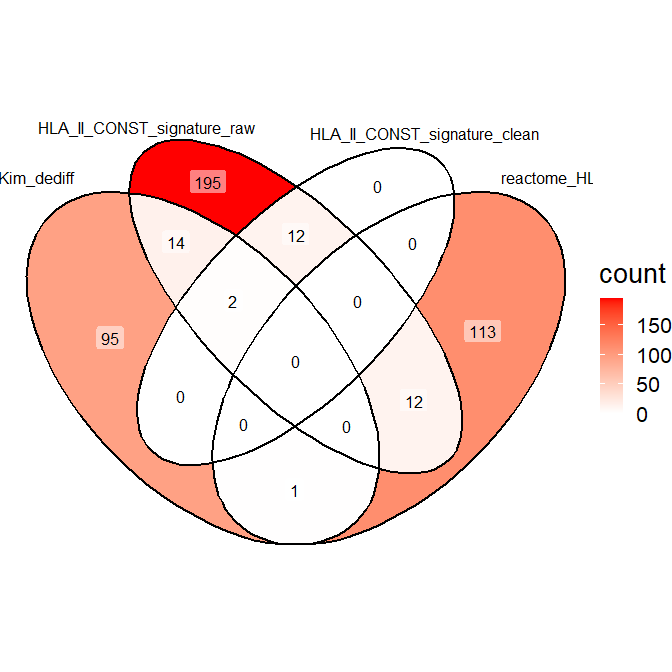<!-- -->

``` r
combined_vst <- vst(combined_dds, blind = TRUE)
expr <- assay(combined_vst)
expr_mat <- as.matrix(expr)
mode(expr_mat) <- "numeric"

# de-duplicate genes if needed (keep the most variable probe/gene)
if (any(duplicated(rownames(expr_mat)))) {
  expr_mat <- expr_mat[!duplicated(rownames(expr_mat)), ]
}

gsparam_kim <- ssgseaParam(exprData = expr_mat, geneSets = gene_sets)
ssgsea_scores_kim <- GSVA::gsva(param = gsparam_kim,verbose = TRUE)
```

    ## ℹ GSVA version 2.2.0

    ## ! 176 genes with constant values throughout the samples

    ## ℹ Calculating  ssGSEA scores for 4 gene sets

    ## ℹ Calculating ranks

    ## ℹ Calculating rank weights

    ## ℹ Normalizing ssGSEA scores

    ## ✔ Calculations finished

``` r
ssgsea_z_kim <- t(scale(t(ssgsea_scores_kim)))

annots <- combined_dds$KNN_cluster
names(annots) <- colnames(combined_dds)
ann_colors <- list(
  HLA_status = c(
    HLA_low        = "#0384fc",
    HLA_mid_low         = "darkblue",
    HLA_mid_high= "#8b0000",
    HLA_high   = "red"
  )
)
levels4 <- c("HLA_high", "HLA_mid_high", "HLA_mid_low", "HLA_low") 
annot_df_kim <- data.frame(
  HLA_status = factor(annots[colnames(ssgsea_z_kim)], levels = levels4)
)

CIITA_counts <- assay(vst(combined_dds))["CIITA",]
IFN_dediff_score <- ssgsea_z_kim[ "Kim_dediff",]
IFN_dediff_score <- IFN_dediff_score[names(CIITA_counts)]
HLA_II_CONST_signature_raw_score <- ssgsea_z_kim[ "HLA_II_CONST_signature_raw",]
HLA_II_CONST_signature_raw_score <- HLA_II_CONST_signature_raw_score[names(CIITA_counts)]
HLA_II_CONST_signature_clean_score <- ssgsea_z_kim[ "HLA_II_CONST_signature_clean",]
HLA_II_CONST_signature_clean_score <- HLA_II_CONST_signature_clean_score[names(CIITA_counts)]
reactome_HLA_II_score <- ssgsea_z_kim[ "reactome_HLA_II",]
reactome_HLA_II_score <- reactome_HLA_II_score[names(CIITA_counts)]


scatterdata <- rbind(CIITA_counts, IFN_dediff_score, HLA_II_CONST_signature_raw_score, HLA_II_CONST_signature_clean_score, reactome_HLA_II_score)
scatterdata <- as.data.frame(t(scatterdata))
scatterdata$Sample <- rownames(scatterdata)
scatterdata<- scatterdata %>% left_join(as.data.frame(colData(combined_dds)), by = "Sample")


IFN_dediff_plot <- ggscatter(
  scatterdata,
  x = "CIITA_counts",
  y = "IFN_dediff_score",
  shape = "Dataset",
  fill = "KNN_cluster",
  color = "KNN_cluster",
  merge = TRUE,
  cor.coef = TRUE,
  title = "IFN dediff score - CIITA expression"
) +
  geom_smooth(
    data = scatterdata,
    mapping = aes(
      x = CIITA_counts,
      y = IFN_dediff_score,
      group = 1
    ),
    method = "lm",
    formula = y ~ x,
    se = TRUE,
    inherit.aes = FALSE,
    color = "black",
    fill = "grey70"
  ) +
  scale_color_manual(values = c(
    HLA_low = "#0384fc",
    HLA_mid_low = "darkblue",
    HLA_mid_high = "#8b0000",
    HLA_high = "red"
  )) +
  scale_fill_manual(values = c(
    HLA_low = "#0384fc",
    HLA_mid_low = "darkblue",
    HLA_mid_high = "#8b0000",
    HLA_high = "red"
  ))
IFN_dediff_plot
```

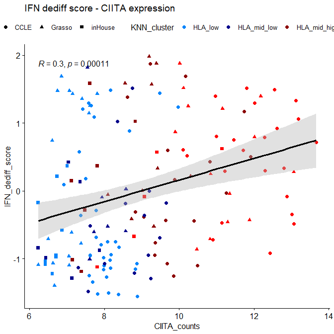<!-- -->

``` r
HLA_II_CONST_clean_plot <- ggscatter(
  scatterdata,
  x = "CIITA_counts",
  y = "HLA_II_CONST_signature_clean_score",
  shape = "Dataset",
  fill = "KNN_cluster",
  color = "KNN_cluster",
  merge = TRUE,
  cor.coef = TRUE,
  title = "HLA-II^CONST+ dediff score - CIITA expression"
) +
  geom_smooth(
    data = scatterdata,
    mapping = aes(
      x = CIITA_counts,
      y = HLA_II_CONST_signature_clean_score,
      group = 1
    ),
    method = "lm",
    formula = y ~ x,
    se = TRUE,
    inherit.aes = FALSE,
    color = "black",
    fill = "grey70"
  ) +
  scale_color_manual(values = c(
    HLA_low = "#0384fc",
    HLA_mid_low = "darkblue",
    HLA_mid_high = "#8b0000",
    HLA_high = "red"
  )) +
  scale_fill_manual(values = c(
    HLA_low = "#0384fc",
    HLA_mid_low = "darkblue",
    HLA_mid_high = "#8b0000",
    HLA_high = "red"
  ))
HLA_II_CONST_clean_plot
```

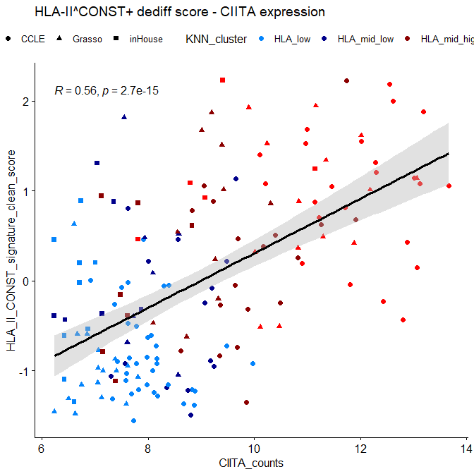<!-- -->

``` r
HLA_II_CONST_raw_plot <- ggscatter(
  scatterdata,
  x = "CIITA_counts",
  y = "HLA_II_CONST_signature_raw_score",
  shape = "Dataset",
  fill = "KNN_cluster",
  color = "KNN_cluster",
  merge = TRUE,
  cor.coef = TRUE,
  title = "HLA-II^CONST+ dediff score raw - CIITA expression"
) +
  geom_smooth(
    data = scatterdata,
    mapping = aes(
      x = CIITA_counts,
      y = HLA_II_CONST_signature_raw_score,
      group = 1
    ),
    method = "lm",
    formula = y ~ x,
    se = TRUE,
    inherit.aes = FALSE,
    color = "black",
    fill = "grey70"
  ) +
  scale_color_manual(values = c(
    HLA_low = "#0384fc",
    HLA_mid_low = "darkblue",
    HLA_mid_high = "#8b0000",
    HLA_high = "red"
  )) +
  scale_fill_manual(values = c(
    HLA_low = "#0384fc",
    HLA_mid_low = "darkblue",
    HLA_mid_high = "#8b0000",
    HLA_high = "red"
  ))
HLA_II_CONST_raw_plot
```

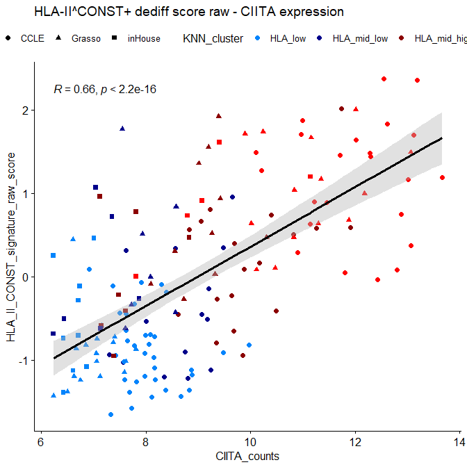<!-- -->

``` r
reactome_plot <- ggscatter(
  scatterdata,
  x = "CIITA_counts",
  y = "reactome_HLA_II_score",
  shape = "Dataset",
  fill = "KNN_cluster",
  color = "KNN_cluster",
  merge = TRUE,
  cor.coef = TRUE,
  title = "HLA-II reactome - CIITA expression"
) +
  geom_smooth(
    data = scatterdata,
    mapping = aes(
      x = CIITA_counts,
      y = reactome_HLA_II_score,
      group = 1
    ),
    method = "lm",
    formula = y ~ x,
    se = TRUE,
    inherit.aes = FALSE,
    color = "black",
    fill = "grey70"
  ) +
  scale_color_manual(values = c(
    HLA_low = "#0384fc",
    HLA_mid_low = "darkblue",
    HLA_mid_high = "#8b0000",
    HLA_high = "red"
  )) +
  scale_fill_manual(values = c(
    HLA_low = "#0384fc",
    HLA_mid_low = "darkblue",
    HLA_mid_high = "#8b0000",
    HLA_high = "red"
  ))
reactome_plot
```

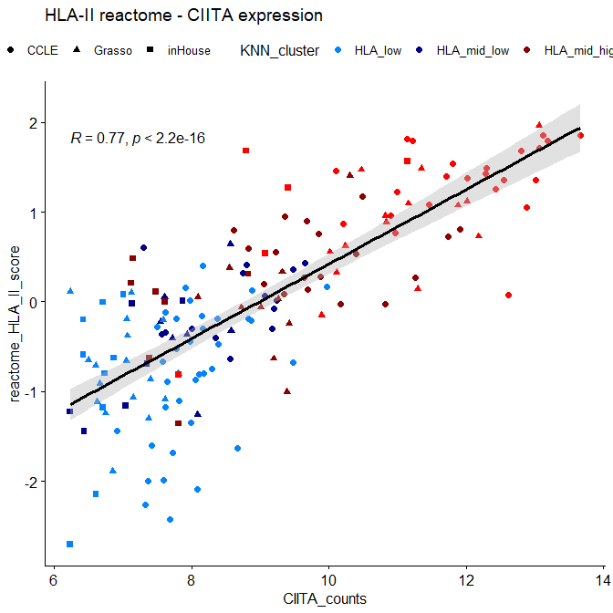<!-- -->

# VALIDATION

## Get in House biopsy data

``` r
source("TIL_data_preparation.R")

stopifnot(is.matrix(TIL_counts))
sym <- rownames(TIL_counts)

# 1) biomaRt: SYMBOL -> Ensembl + transcript lengths
# ensembl <- useEnsembl(
#   biomart = "genes",
#   dataset = "hsapiens_gene_ensembl"
# )
annot <- getBM(
  attributes = c("hgnc_symbol","ensembl_gene_id","gene_biotype",
                 "ensembl_transcript_id","transcript_length","transcript_is_canonical"),
  filters    = "hgnc_symbol",
  values     = unique(sym),
  mart       = ensembl
)

# Keep only rows with symbol present in your matrix
annot <- annot %>% dplyr::filter(hgnc_symbol %in% sym)

# 2) Prefer protein-coding; prefer canonical transcripts if present
annot_filt <- annot %>%
  dplyr::filter(gene_biotype == "protein_coding") %>%
  mutate(is_canonical = transcript_is_canonical == 1)

# 3) Compute one length per SYMBOL (in BASES)
# First, within each SYMBOL pick canonical transcripts if any; else use all.
length_by_symbol <- annot_filt %>%
  group_by(hgnc_symbol) %>%
  dplyr::mutate(use_canonical = any(is_canonical)) %>%
  dplyr::filter(if (dplyr::first(use_canonical)) is_canonical else TRUE) %>%
  summarise(gene_length_bases = median(transcript_length, na.rm = TRUE), .groups = "drop")

# Fallback: for symbols that dropped out (no protein_coding or NA), use any biotype
missing_syms <- setdiff(sym, length_by_symbol$hgnc_symbol)
if (length(missing_syms) > 0) {
  fallback <- annot %>%
    dplyr::filter(hgnc_symbol %in% missing_syms) %>%
    dplyr::group_by(hgnc_symbol) %>%
    dplyr::summarise(gene_length_bases = median(transcript_length, na.rm = TRUE), .groups = "drop")
  length_by_symbol <- bind_rows(length_by_symbol, fallback) %>%
    distinct(hgnc_symbol, .keep_all = TRUE)
}

# 4) Align lengths to counts (BASES; do NOT divide by 1000)
gene_len <- length_by_symbol$gene_length_bases[match(sym, length_by_symbol$hgnc_symbol)]

if (any(duplicated(sym))) {
  message("Duplicated symbols detected; collapsing by sum.")
  TIL_counts <- rowsum(TIL_counts, group = sym, reorder = FALSE)
  sym <- rownames(TIL_counts)
  gene_len <- length_by_symbol$gene_length_bases[match(sym, length_by_symbol$hgnc_symbol)]
}

# Warn about missing lengths
na_len <- is.na(gene_len)
if (any(na_len)) {
  message(sprintf("Dropping %d genes with missing lengths before RPKM.", sum(na_len)))
}
```

    ## Dropping 8049 genes with missing lengths before RPKM.

``` r
# 5) Create DGEList with lengths (in BASES)
dge <- DGEList(counts = TIL_counts[!na_len, , drop = FALSE],
               genes  = data.frame(Symbol = sym[!na_len],
                                   Length = gene_len[!na_len],
                                   row.names = sym[!na_len]))

# 6) TMM normalization
dge <- calcNormFactors(dge)

# 7) Compute RPKM/FPKM
# edgeR::rpkm expects 'gene.length' in BASES and divides by 1000 internally.
rpkm_mat <- rpkm(dge, gene.length = dge$genes$Length, normalized.lib.sizes = TRUE)

# TPM not used but code left for future changes
# TPM = scale RPK to 1e6
# RPK = counts / (length_kb); length_kb = length_bases / 1000
length_kb <- dge$genes$Length / 1000
rpk <- sweep(dge$counts, 1, length_kb, "/")
tpm_mat <- sweep(rpk, 2, colSums(rpk), "/") * 1e6

rank_data_til <- rankGenes(rpkm_mat)
```

## Compare biopsy signature score with TCL HLA-II expression

``` r
tcl_data <- read.xlsx("../controlled_data/TIL/MHC_expression_TCLs.xlsx",
                      sheet = "Final Data")

scores_fortcl <- simpleScore(rank_data_til, upSet = up_list, downSet = down_list, centerScore = TRUE)
scores_fortcl$sample <- rownames(scores_fortcl)

validation_signature <- tcl_data %>%
  mutate(sample = matching_col) %>%
  inner_join(dplyr::select(scores_fortcl, sample, sig = TotalScore), by = "sample") %>%
  transmute(
    sample,
    fc       = as.numeric(FC.Baseline.to.Isotype),
    fc_log   = log10(pmax(fc, 1e-4)),              # log-transform; protects from 0
    sig      = as.numeric(sig),
    fc_ifn   = as.numeric(FC.IFN.to.isotype),
    fc_ifn_log   = log10(pmax(fc_ifn, 1e-4)),
    reac_base = as.numeric(reactivity_baseline_YTIL),
    reac_IFNg = as.numeric(reactivity_IFNg_yTIL)
  )

## 1) HLA-II FC vs isotype
cc_fc <- complete.cases(validation_signature$sig, validation_signature$fc)
ct_fc <- cor.test(validation_signature$sig[cc_fc],
                  validation_signature$fc_log[cc_fc],
                  method = "spearman", exact = FALSE)

ggplot(validation_signature, aes(sig, fc_log)) +
  geom_point(size = 2, alpha = .8) +
  geom_smooth(method = "glm", se = FALSE) +
  labs(
    x = "Biopsy signature score",
    y = "HLA-II FC vs isotype",
    title   = sprintf("Spearman rho = %.2f, p = %.3g", ct_fc$estimate, ct_fc$p.value),
    caption = paste0("N = ", sum(cc_fc))
  ) +
  theme_classic()
```

    ## `geom_smooth()` using formula = 'y ~ x'

<!-- -->

``` r
## 2) CD4+ TIL reactivity (untreated)
cc_reac <- complete.cases(validation_signature$sig, validation_signature$reac_base)
ct_reac <- cor.test(validation_signature$sig[cc_reac],
                    validation_signature$reac_base[cc_reac],
                    method = "spearman", exact = FALSE)

ggplot(validation_signature, aes(sig, reac_base)) +
  geom_point(size = 2, alpha = .8) +
  geom_smooth(method = "glm", se = FALSE) +
  labs(
    x = "Biopsy signature score",
    y = "CD4+ TIL Reactivity (untreated)",
    title   = sprintf("Spearman rho = %.2f, p = %.3g", ct_reac$estimate, ct_reac$p.value),
    caption = paste0("N = ", sum(cc_reac))
  ) +
  theme_classic()
```

    ## `geom_smooth()` using formula = 'y ~ x'

    ## Warning: Removed 4 rows containing non-finite outside the scale range
    ## (`stat_smooth()`).

    ## Warning: Removed 4 rows containing missing values or values outside the scale range
    ## (`geom_point()`).

<!-- -->

``` r
## 3) CD4+ TIL reactivity (IFN)
cc_reac_ifn <- complete.cases(validation_signature$sig, validation_signature$reac_IFNg)
ct_reac_ifn <- cor.test(validation_signature$sig[cc_reac_ifn],
                        validation_signature$reac_IFNg[cc_reac_ifn],
                        method = "spearman", exact = FALSE)

ggplot(validation_signature, aes(sig, reac_IFNg)) +
  geom_point(size = 2, alpha = .8) +
  geom_smooth(method = "glm", se = FALSE) +
  labs(
    x = "Biopsy signature score",
    y = "CD4 TIL reactivity (IFN)",
    title   = sprintf("Spearman rho = %.2f, p = %.3g", ct_reac_ifn$estimate, ct_reac_ifn$p.value),
    caption = paste0("N = ", sum(cc_reac_ifn))
  ) +
  theme_classic()
```

    ## `geom_smooth()` using formula = 'y ~ x'

    ## Warning: Removed 4 rows containing non-finite outside the scale range (`stat_smooth()`).
    ## Removed 4 rows containing missing values or values outside the scale range
    ## (`geom_point()`).

<!-- -->

``` r
## 4) HLA-II FC vs isotype (IFN condition)
cc_ifn <- complete.cases(validation_signature$sig, validation_signature$fc_ifn_log)
ct_ifn <- cor.test(validation_signature$sig[cc_ifn],
                   validation_signature$fc_ifn_log[cc_ifn],
                   method = "spearman", exact = FALSE)

ggplot(validation_signature, aes(sig, fc_ifn_log)) +
  geom_point(size = 2, alpha = .8) +
  geom_smooth(method = "glm", se = FALSE) +
  labs(
    x = "Biopsy signature score",
    y = "HLA-II FC vs isotype (IFN)",
    title   = sprintf("Spearman rho = %.2f, p = %.3g", ct_ifn$estimate, ct_ifn$p.value),
    caption = paste0("N = ", sum(cc_ifn))
  ) +
  theme_classic()
```

    ## `geom_smooth()` using formula = 'y ~ x'

    ## Warning: Removed 4 rows containing non-finite outside the scale range (`stat_smooth()`).
    ## Removed 4 rows containing missing values or values outside the scale range
    ## (`geom_point()`).

<!-- -->

``` r
## this is the result using class II genes only
scores_fortcl_HLA <- simpleScore(rank_data_til, upSet = HLAII_genes, centerScore = TRUE)
scores_fortcl_HLA$sample <- rownames(scores_fortcl)

validation_signature_HLA <- tcl_data %>%
  mutate(sample = matching_col) %>%
  inner_join(dplyr::select(scores_fortcl_HLA, sample, sig = TotalScore), by = "sample") %>%
  transmute(
    sample,
    fc       = as.numeric(FC.Baseline.to.Isotype),
    fc_log   = log10(pmax(fc, 1e-4)),              # log-transform; protects from 0
    sig      = as.numeric(sig),
    fc_ifn   = as.numeric(FC.IFN.to.isotype),
    fc_ifn_log   = log10(pmax(fc_ifn, 1e-4)),
    reac_base = as.numeric(reactivity_baseline_YTIL),
    reac_IFNg = as.numeric(reactivity_IFNg_yTIL)
  )

## 1) HLA-II FC vs isotype
cc_fc_hla <- complete.cases(validation_signature_HLA$sig, validation_signature_HLA$fc_log)
ct_fc_hla <- cor.test(validation_signature_HLA$sig[cc_fc_hla],
                  validation_signature_HLA$fc_log[cc_fc_hla],
                  method = "spearman", exact = FALSE)

ggplot(validation_signature_HLA, aes(sig, fc_log)) +
  geom_point(size = 2, alpha = .8) +
  geom_smooth(method = "glm", se = FALSE) +
  labs(
    x = "Biopsy HLA-II score",
    y = "HLA-II FC vs isotype",
    title   = sprintf("Spearman rho = %.2f, p = %.3g", ct_fc_hla$estimate, ct_fc_hla$p.value),
    caption = paste0("N = ", sum(cc_fc))
  ) +
  theme_classic()
```

    ## `geom_smooth()` using formula = 'y ~ x'

<!-- -->

``` r
## 2) CD4+ TIL reactivity (untreated)
cc_reac_hla <- complete.cases(validation_signature_HLA$sig, validation_signature_HLA$reac_base)
ct_reac <- cor.test(validation_signature_HLA$sig[cc_reac_hla],
                    validation_signature_HLA$reac_base[cc_reac_hla],
                    method = "spearman", exact = FALSE)

ggplot(validation_signature_HLA, aes(sig, reac_base)) +
  geom_point(size = 2, alpha = .8) +
  geom_smooth(method = "glm", se = FALSE) +
  labs(
    x = "Biopsy HLA-II score",
    y = "CD4+ TIL Reactivity (untreated)",
    title   = sprintf("Spearman rho = %.2f, p = %.3g", ct_reac$estimate, ct_reac$p.value),
    caption = paste0("N = ", sum(cc_reac))
  ) +
  theme_classic()
```

    ## `geom_smooth()` using formula = 'y ~ x'

    ## Warning: Removed 4 rows containing non-finite outside the scale range (`stat_smooth()`).
    ## Removed 4 rows containing missing values or values outside the scale range
    ## (`geom_point()`).

<!-- -->

``` r
## 3) CD4+ TIL reactivity (IFN)
cc_reac_ifn_hla <- complete.cases(validation_signature_HLA$sig, validation_signature_HLA$reac_IFNg)
ct_reac_ifn <- cor.test(validation_signature_HLA$sig[cc_reac_ifn_hla],
                        validation_signature_HLA$reac_IFNg[cc_reac_ifn_hla],
                        method = "spearman", exact = FALSE)

ggplot(validation_signature_HLA, aes(sig, reac_IFNg)) +
  geom_point(size = 2, alpha = .8) +
  geom_smooth(method = "glm", se = FALSE) +
  labs(
    x = "Biopsy HLA-II score",
    y = "CD4 TIL reactivity (IFN)",
    title   = sprintf("Spearman rho = %.2f, p = %.3g", ct_reac_ifn$estimate, ct_reac_ifn$p.value),
    caption = paste0("N = ", sum(cc_reac_ifn))
  ) +
  theme_classic()
```

    ## `geom_smooth()` using formula = 'y ~ x'

    ## Warning: Removed 4 rows containing non-finite outside the scale range (`stat_smooth()`).
    ## Removed 4 rows containing missing values or values outside the scale range
    ## (`geom_point()`).

<!-- -->

``` r
## 4) HLA-II FC vs isotype (IFN condition)
cc_ifn_hla <- complete.cases(validation_signature_HLA$sig, validation_signature_HLA$fc_ifn_log)
ct_ifn_hla <- cor.test(validation_signature_HLA$sig[cc_ifn_hla],
                   validation_signature_HLA$fc_ifn_log[cc_ifn_hla],
                   method = "spearman", exact = FALSE)

ggplot(validation_signature_HLA, aes(sig, fc_ifn_log)) +
  geom_point(size = 2, alpha = .8) +
  geom_smooth(method = "glm", se = FALSE) +
  labs(
    x = "Biopsy HLA-II score",
    y = "HLA-II FC vs isotype (IFN)",
    title   = sprintf("Spearman rho = %.2f, p = %.3g", ct_ifn_hla$estimate, ct_ifn_hla$p.value),
    caption = paste0("N = ", sum(cc_ifn))
  ) +
  theme_classic()
```

    ## `geom_smooth()` using formula = 'y ~ x'

    ## Warning: Removed 4 rows containing non-finite outside the scale range (`stat_smooth()`).
    ## Removed 4 rows containing missing values or values outside the scale range
    ## (`geom_point()`).

<!-- -->

# SURVIVAL ANALYSIS

# GDC data preparation

``` r
# 1. Query and download FPKM counts + clinical
# query <- GDCquery(project = "TCGA-SKCM",
#                   data.category = "Transcriptome Profiling",
#                   data.type     = "Gene Expression Quantification",
#                   workflow.type = "STAR - Counts")

# GDCdownload(query, directory = "../controlled_data/GDC_data/")
# dataSE_sckm <- GDCprepare(query, directory = "../../GDCdata/")

load("../controlled_data/GDCdata/TCGA-SKCM/dataSE_sckm.RData")
expr_skcm  <- assay(dataSE_sckm)               # sample × gene FPKM
clin_skcm  <- colData(dataSE_sckm)  
counts_mel = expr_skcm

clinical_data <- read.xlsx(xlsxFile ="../public/Survival_data_TCGA_upd.xlsx", rowNames = T)
clin_final <- as.data.frame(merge(x = clinical_data,y = clin_skcm, by.x = "bcr_patient_barcode", by.y = "patient"))

rownames(counts_mel) <- sub("\\..*$", "", rownames(counts_mel))
# 4) Retrieve gene lengths (median transcript length per gene) from Ensembl
# ensembl <- useEnsembl("ensembl", dataset="hsapiens_gene_ensembl")
geneAnnot <- getBM(
  attributes = c("ensembl_gene_id", "transcript_length"),
  filters    = "ensembl_gene_id",
  values     = rownames(counts_mel),
  mart       = ensembl
)
# compute median transcript length
library(dplyr)
geneLengths <- geneAnnot %>%
  dplyr::group_by(ensembl_gene_id) %>%
  dplyr::summarise(median_length = median(transcript_length)) %>%
  dplyr::ungroup()


# match lengths to your count matrix
length.kb <- geneLengths$median_length[match(rownames(counts_mel),
                                             geneLengths$ensembl_gene_id)] / 1000

# 5) Create DGEList and calculate normalization factors
dge <- DGEList(counts = counts_mel, genes = data.frame(Length = length.kb))
```

    ## Warning: Count matrix has duplicated rownames

``` r
dge <- calcNormFactors(dge)  # TMM normalization

# 6) Compute FPKM
fpkm.mat_skcm <- rpkm(dge,
                 gene.length        = dge$genes$Length,
                 normalized.lib.sizes = TRUE)

library(org.Hs.eg.db)
```

    ## Loading required package: AnnotationDbi

    ## 
    ## Attaching package: 'AnnotationDbi'

    ## The following object is masked from 'package:clusterProfiler':
    ## 
    ##     select

    ## The following object is masked from 'package:dplyr':
    ## 
    ##     select

    ## 

``` r
library(AnnotationDbi)


# 2. Map IDs
hugo <- mapIds(
  org.Hs.eg.db,
  keys      = rownames(fpkm.mat_skcm),
  column    = "SYMBOL",
  keytype   = "ENSEMBL",
  multiVals = "first"
)
```

    ## 'select()' returned 1:many mapping between keys and columns

# Administrative censoring at 15 years

``` r
#administrative censoring at 15 years
clin_final$DSS.years <- clin_final$DSS.time/365
clin_final$DSS.years_censored   <- pmin(clin_final$DSS.years, 15)
clin_final$DSS_censored <- ifelse(clin_final$DSS.years > 15, 0, clin_final$DSS)
clin_final$OS.years <- clin_final$OS.time/365
clin_final$OS.years_censored   <- pmin(clin_final$OS.years, 15)
clin_final$OS_censored <- ifelse(clin_final$OS.years > 15, 0, clin_final$OS)
clin_final$PFI.years <- clin_final$PFI.time/365
clin_final$PFI.years_censored   <- pmin(clin_final$PFI.years, 15)
clin_final$PFI_censored <- ifelse(clin_final$PFI.years > 15, 0, clin_final$PFI)

cat(paste0("Administrative censoring: ", round((length(which(clin_final$DSS.years > 15))/length(clin_final$DSS.years))*100), "%"))
```

    ## Administrative censoring: 5%

# Univariate analysis on TCGA-SKCM

``` r
#Subset out NAs and rename the exp matrix
keep <- !is.na(hugo)
expr_skcm <- fpkm.mat_skcm[keep, , drop=FALSE]
rownames(expr_skcm) <- hugo[keep]

#get clinical data
md <- read.table("../public/md_SKCM.txt", header = T, sep = "\t")
# define your lists
up_list   <- rownames(subset(gene_signature_manually_curated, log2FoldChange > 0))
down_list <- rownames(subset(gene_signature_manually_curated, log2FoldChange < 0))

rank_data <- rankGenes(expr_skcm)

# compute simple singscore
scores <- simpleScore(rank_data,
                      upSet   = up_list,
                      downSet = down_list)
rownames(scores) <- gsub(x= rownames(scores), pattern = "\\.", replacement = "-")
scores$sample <- rownames(scores)
scores <- subset(scores, sample %in% rownames(md))

clin_final <- subset(clin_final, barcode %in% scores$sample)
clin_final$sample <- clin_final$barcode
scores <- scores[order(scores$sample, clin_final$sample),]

# assuming rownames(md) are your sample IDs:
clin_final$signature_score <- scores$TotalScore[
  match(clin_final$sample, scores$sample)
]

# Check they all matched:
stopifnot(!any(is.na(clin_final$signature_score)))

clin_final <- clin_final %>% as.data.frame() %>%
  dplyr::mutate(group = if_else(signature_score >= 
                           quantile(signature_score, 0.75),
                         "High","Low"))
clin_final$group <- relevel(as.factor(clin_final$group), ref = "Low")
library(survival)
library(survminer)

#Fit the survival model with a continuous z-score as a sensitivity analysis
clin_final$score_z <- as.numeric(scale(clin_final$signature_score))

fit_os_cont <- coxph(
  Surv(OS.years_censored, OS_censored) ~ score_z,
  data = clin_final
)
summary(fit_os_cont)
```

    ## Call:
    ## coxph(formula = Surv(OS.years_censored, OS_censored) ~ score_z, 
    ##     data = clin_final)
    ## 
    ##   n= 456, number of events= 204 
    ##    (15 observations deleted due to missingness)
    ## 
    ##             coef exp(coef) se(coef)      z Pr(>|z|)    
    ## score_z -0.27609   0.75875  0.07268 -3.799 0.000145 ***
    ## ---
    ## Signif. codes:  0 '***' 0.001 '**' 0.01 '*' 0.05 '.' 0.1 ' ' 1
    ## 
    ##         exp(coef) exp(-coef) lower .95 upper .95
    ## score_z    0.7587      1.318     0.658    0.8749
    ## 
    ## Concordance= 0.579  (se = 0.023 )
    ## Likelihood ratio test= 14.95  on 1 df,   p=1e-04
    ## Wald test            = 14.43  on 1 df,   p=1e-04
    ## Score (logrank) test = 14.46  on 1 df,   p=1e-04

``` r
fit_pfs_cont <- coxph(
  Surv(PFI.years_censored, PFI_censored) ~ score_z,
  data = clin_final
)
summary(fit_pfs_cont)
```

    ## Call:
    ## coxph(formula = Surv(PFI.years_censored, PFI_censored) ~ score_z, 
    ##     data = clin_final)
    ## 
    ##   n= 457, number of events= 299 
    ##    (14 observations deleted due to missingness)
    ## 
    ##             coef exp(coef) se(coef)     z Pr(>|z|)  
    ## score_z -0.14840   0.86208  0.06082 -2.44   0.0147 *
    ## ---
    ## Signif. codes:  0 '***' 0.001 '**' 0.01 '*' 0.05 '.' 0.1 ' ' 1
    ## 
    ##         exp(coef) exp(-coef) lower .95 upper .95
    ## score_z    0.8621       1.16    0.7652    0.9712
    ## 
    ## Concordance= 0.543  (se = 0.02 )
    ## Likelihood ratio test= 6.06  on 1 df,   p=0.01
    ## Wald test            = 5.95  on 1 df,   p=0.01
    ## Score (logrank) test = 5.95  on 1 df,   p=0.01

``` r
# 4) Fit the survival model in one go, using the data frame

fit_dss <- survfit(
  Surv(DSS.years_censored, DSS_censored) ~ group,
  data = clin_final
)

#proportional hazard model
cat("PH test p value: ", cox.zph(coxph(Surv(DSS.years_censored, DSS_censored) ~ group, data = clin_final))[["table"]]["GLOBAL","p"])
```

    ## PH test p value:  0.1271422

``` r
names(fit_dss$strata) <- gsub("group=","", names(fit_dss$strata))
s_cox <- coxph(Surv(DSS.years_censored, DSS_censored) ~ group, data = clin_final)
s_cox   <- summary(s_cox)
hr     <- s_cox$coefficients[, "exp(coef)"]
ci_lo  <- s_cox$conf.int[, "lower .95"]
ci_hi  <- s_cox$conf.int[, "upper .95"]
pval   <- s_cox$coefficients[, "Pr(>|z|)"]
hr_lab <- sprintf("HR=%.2f (95%% CI %.2f–%.2f)", hr, ci_lo, ci_hi)
p_lab  <- paste0("p = ", sprintf("%.4f", pval))

# 5a) plot DSS
ggsurvfit(fit_dss, linewidth=0.8)+
    add_censor_mark() +
    add_risktable(
        size            = 7,
        theme           = theme_risktable_default(plot.title.size  = 15),
        risktable_stats = "{n.risk} ({cum.event})",
        stats_label     = "Number at risk",risktable_height = 0.2
    ) +add_risktable_strata_symbol(symbol = "•", size = 15)+
    labs(
        x = "Years",
        y = paste0("Disease specific survival", " (%)")
    ) +
  scale_ggsurvfit(x_scales = list(limits = c(0,15), breaks=seq(0,15, by=3)))+
    scale_y_continuous(limits = c(0, 1),
                       labels = scales::percent_format(accuracy = 1),
                       expand = c(0, 0)) +
    theme_classic() +
    theme(
        plot.title       = element_text(hjust = 0.5, size = 20),
        plot.subtitle    = element_text(hjust = 0.5, size = 18),
        axis.title.x     = element_text(size = 20),
        axis.title.y     = element_text(size = 20, margin = margin(t = 0, r = 0, b = 0, l = 0)),
        axis.text.x      = element_text(size = 15),
        axis.text.y      = element_text(size = 15),
        legend.position  = "top",
        legend.direction = "vertical",
        legend.text      = element_text(size = 25),
        legend.key.size  = unit(30, "bigpts"),
        legend.title     = element_blank(),
        plot.margin      = unit(c(0,0.2,0,0), 'lines')
    )+scale_color_manual(values = c("High" = "red", "Low" = "blue"))+
  ggplot2::annotate(
        "text",
        x     = 0,
        y     = 0.2,
        label = hr_lab,
        size  = 10,
        hjust = 0
      ) +
      ggplot2::annotate(
        "text",
        x     = 0,
        y     = 0.1,
        label = p_lab,
        size  = 10,
        hjust = 0
      )
```

    ## Scale for y is already present.
    ## Adding another scale for y, which will replace the existing scale.

<!-- -->

``` r
fit_os <- survfit(
  Surv(OS.years_censored, OS_censored) ~ group,
  data = clin_final
)  

fit_pfs <- survfit(
  Surv(PFI.years_censored, PFI_censored) ~ group,
  data = clin_final
)

# 5b) Plot
ggsurvplot(
  fit_os,
  data       = clin_final,
  pval       = TRUE,
  risk.table = TRUE
)
```

    ## Warning: Using `size` aesthetic for lines was deprecated in ggplot2 3.4.0.
    ## ℹ Please use `linewidth` instead.
    ## ℹ The deprecated feature was likely used in the ggpubr package.
    ##   Please report the issue at <https://github.com/kassambara/ggpubr/issues>.
    ## This warning is displayed once per session.
    ## Call `lifecycle::last_lifecycle_warnings()` to see where this warning was
    ## generated.

    ## Ignoring unknown labels:
    ## • colour : "Strata"

<!-- -->

``` r
# 5c) Plot PFS
ggsurvplot(
  fit_pfs,
  data       = clin_final,
  pval       = TRUE,
  risk.table = TRUE
)
```

    ## Ignoring unknown labels:
    ## • colour : "Strata"

<!-- -->

## Subgroup analysis on the few ICI treated patients in TCGA data

``` r
library(data.table)
```

    ## 
    ## Attaching package: 'data.table'

    ## The following objects are masked from 'package:dplyr':
    ## 
    ##     between, first, last

    ## The following object is masked from 'package:SummarizedExperiment':
    ## 
    ##     shift

    ## The following object is masked from 'package:GenomicRanges':
    ## 
    ##     shift

    ## The following object is masked from 'package:IRanges':
    ## 
    ##     shift

    ## The following objects are masked from 'package:S4Vectors':
    ## 
    ##     first, second

``` r
clin_ici_tcga <- fread("E:/PhD_projects/MHCII_project/TCGA_SKCM/clinical_data_ICI_patients_SKCM/clinical.tsv")
ici_treated_tcga_skcm <- unique(clin_ici_tcga$cases.submitter_id)
clin_final <- clin_final %>% mutate(ICI= case_when(bcr_patient_barcode %in% ici_treated_tcga_skcm ~ "Yes",
                                                             !(bcr_patient_barcode %in% ici_treated_tcga_skcm) ~ "No")) 
table(clin_final$ICI)
```

    ## 
    ##  No Yes 
    ## 447  24

``` r
fit_cox_ICI <- survfit(
  Surv(DSS.years_censored, DSS_censored) ~ group,
  data = dplyr::filter(clin_final, ICI == "Yes")
)

names(fit_cox_ICI$strata) <- gsub("group=","", names(fit_cox_ICI$strata))
s_cox_ICI <- coxph(Surv(DSS.years_censored, DSS_censored) ~ group, data = dplyr::filter(clin_final, ICI == "Yes"))
s_cox_ICI   <- summary(s_cox_ICI)
hr     <- s_cox_ICI$coefficients[, "exp(coef)"]
ci_lo  <- s_cox_ICI$conf.int[, "lower .95"]
ci_hi  <- s_cox_ICI$conf.int[, "upper .95"]
pval   <- s_cox_ICI$coefficients[, "Pr(>|z|)"]
hr_lab <- sprintf("HR=%.2f (95%% CI %.2f–%.2f)", hr, ci_lo, ci_hi)
p_lab  <- paste0("p = ", sprintf("%.4f", pval))

# plot dss
ggsurvfit(fit_cox_ICI, linewidth=0.8)+
    add_censor_mark() +
    add_risktable(
        size            = 7,
        theme           = theme_risktable_default(plot.title.size  = 15),
        risktable_stats = "{n.risk} ({cum.event})",
        stats_label     = "Number at risk",risktable_height = 0.2
    ) +add_risktable_strata_symbol(symbol = "•", size = 15)+
    labs(
        x = "Years",
        y = paste0("Disease specific survival", " (%)")
    ) +
  scale_ggsurvfit(x_scales = list(limits = c(0,15), breaks=seq(0,15, by=3)))+
    scale_y_continuous(limits = c(0, 1),
                       labels = scales::percent_format(accuracy = 1),
                       expand = c(0, 0)) +
    theme_classic() +
    theme(
        plot.title       = element_text(hjust = 0.5, size = 20),
        plot.subtitle    = element_text(hjust = 0.5, size = 18),
        axis.title.x     = element_text(size = 20),
        axis.title.y     = element_text(size = 20, margin = margin(t = 0, r = 0, b = 0, l = 0)),
        axis.text.x      = element_text(size = 15),
        axis.text.y      = element_text(size = 15),
        legend.position  = "top",
        legend.direction = "vertical",
        legend.text      = element_text(size = 25),
        legend.key.size  = unit(30, "bigpts"),
        legend.title     = element_blank(),
        plot.margin      = unit(c(0,0.2,0,0), 'lines')
    )+scale_color_manual(values = c("High" = "red", "Low" = "blue"))+
  ggplot2::annotate(
        "text",
        x     = 0,
        y     = 0.2,
        label = hr_lab,
        size  = 10,
        hjust = 0
      ) +
      ggplot2::annotate(
        "text",
        x     = 0,
        y     = 0.1,
        label = p_lab,
        size  = 10,
        hjust = 0
      )
```

    ## Scale for y is already present.
    ## Adding another scale for y, which will replace the existing scale.

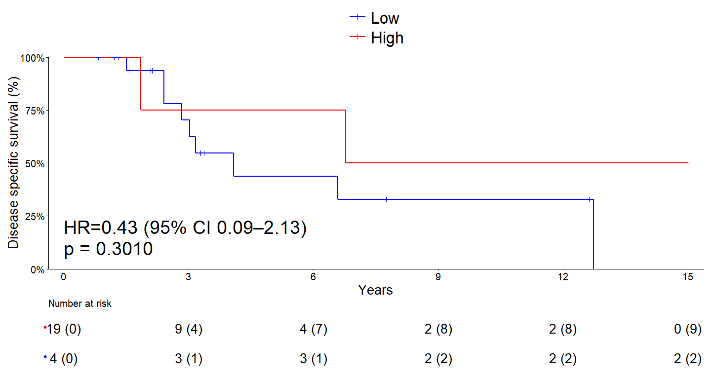<!-- -->

## Subgroup analysis on all the patients who ever received immunotherapy

``` r
clin_immuno_tcga <- fread("../public/all_immunotherapies_SKCM.tsv")
immuno_treated_tcga_skcm <- unique(clin_immuno_tcga$`Case ID`)
clin_final <- clin_final %>% mutate(immunotherapy= case_when(bcr_patient_barcode %in% immuno_treated_tcga_skcm ~ "Yes",
                                                             !(bcr_patient_barcode %in% immuno_treated_tcga_skcm) ~ "No")) 
table(clin_final$immunotherapy)
```

    ## 
    ##  No Yes 
    ## 356 115

``` r
fit_cox_immuno <- survfit(
  Surv(DSS.years_censored, DSS_censored) ~ group+ICI,
  data = dplyr::filter(clin_final, immunotherapy == "Yes")
)

names(fit_cox_immuno$strata) <- gsub("group=","", names(fit_cox_immuno$strata))
clin_final$ICI <- as.factor(clin_final$ICI)
s_cox_Immuno <- coxph(Surv(DSS.years_censored, DSS_censored) ~ group+ICI, data = dplyr::filter(clin_final, immunotherapy == "Yes"))
s_cox_Immuno   <- summary(s_cox_Immuno)
hr     <- s_cox_Immuno$coefficients[, "exp(coef)"]
ci_lo  <- s_cox_Immuno$conf.int[, "lower .95"]
ci_hi  <- s_cox_Immuno$conf.int[, "upper .95"]
pval   <- s_cox_Immuno$coefficients[, "Pr(>|z|)"]
hr_lab <- sprintf("HR=%.2f (95%% CI %.2f–%.2f)", hr, ci_lo, ci_hi)
p_lab  <- paste0("p = ", sprintf("%.4f", pval))

#plot dss
ggsurvfit(fit_cox_immuno, linewidth=0.8)+
    add_censor_mark() +
    add_risktable(
        size            = 7,
        theme           = theme_risktable_default(plot.title.size  = 15),
        risktable_stats = "{n.risk} ({cum.event})",
        stats_label     = "Number at risk",risktable_height = 0.2
    ) +add_risktable_strata_symbol(symbol = "•", size = 15)+
    labs(
        x = "Years",
        y = paste0("Disease specific survival", " (%)")
    ) +
  scale_ggsurvfit(x_scales = list(limits = c(0,15), breaks=seq(0,15, by=3)))+
    scale_y_continuous(limits = c(0, 1),
                       labels = scales::percent_format(accuracy = 1),
                       expand = c(0, 0)) +
    theme_classic() +
    theme(
        plot.title       = element_text(hjust = 0.5, size = 20),
        plot.subtitle    = element_text(hjust = 0.5, size = 18),
        axis.title.x     = element_text(size = 20),
        axis.title.y     = element_text(size = 20, margin = margin(t = 0, r = 0, b = 0, l = 0)),
        axis.text.x      = element_text(size = 15),
        axis.text.y      = element_text(size = 15),
        legend.position  = "top",
        legend.direction = "vertical",
        legend.text      = element_text(size = 25),
        legend.key.size  = unit(30, "bigpts"),
        legend.title     = element_blank(),
        plot.margin      = unit(c(0,0.2,0,0), 'lines')
    )+scale_color_manual(values = c("High, ICI=Yes" = "red", "Low, ICI=Yes" = "blue", "High, ICI=No " = "orange", "Low, ICI=No " = "darkgreen"))+
  ggplot2::annotate(
        "text",
        x     = 0,
        y     = 0.2,
        label = hr_lab,
        size  = 10,
        hjust = 0
      ) +
      ggplot2::annotate(
        "text",
        x     = 0,
        y     = 0.1,
        label = p_lab,
        size  = 10,
        hjust = 0
      )
```

    ## Scale for y is already present.
    ## Adding another scale for y, which will replace the existing scale.

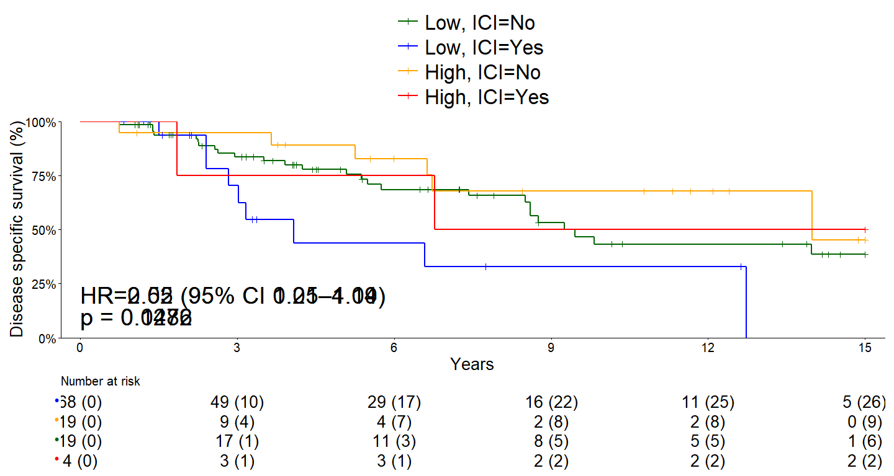<!-- -->

## Prognostic vs predictive role of the signature

``` r
#predictive for ici?
clin_tmp <- clin_final |>
    dplyr::mutate(
        ICI_bin = factor(ICI, levels = c("No","Yes")),   # ensure consistent ref
        sig_z   = as.numeric(scale(signature_score))                # z-score helps stability
    )

m_no_int <- coxph(
    Surv(DSS.years_censored, DSS_censored) ~ sig_z + immunotherapy,
    data = clin_tmp
)

m_int <- coxph(
    Surv(DSS.years_censored, DSS_censored) ~ sig_z * immunotherapy,
    data = clin_tmp
)

anova(m_no_int, m_int, test = "LRT")   # p-value here = evidence of predictiveness
```

    ## Analysis of Deviance Table
    ##  Cox model: response is  Surv(DSS.years_censored, DSS_censored)
    ##  Model 1: ~ sig_z + immunotherapy
    ##  Model 2: ~ sig_z * immunotherapy
    ##    loglik  Chisq Df Pr(>|Chi|)
    ## 1 -931.92                     
    ## 2 -931.82 0.1961  1     0.6579

``` r
summary(m_int)
```

    ## Call:
    ## coxph(formula = Surv(DSS.years_censored, DSS_censored) ~ sig_z * 
    ##     immunotherapy, data = clin_tmp)
    ## 
    ##   n= 450, number of events= 178 
    ##    (21 observations deleted due to missingness)
    ## 
    ##                            coef exp(coef) se(coef)      z Pr(>|z|)    
    ## sig_z                  -0.30537   0.73685  0.08810 -3.466 0.000528 ***
    ## immunotherapyYes       -0.47491   0.62194  0.17685 -2.685 0.007244 ** 
    ## sig_z:immunotherapyYes  0.08376   1.08737  0.18881  0.444 0.657317    
    ## ---
    ## Signif. codes:  0 '***' 0.001 '**' 0.01 '*' 0.05 '.' 0.1 ' ' 1
    ## 
    ##                        exp(coef) exp(-coef) lower .95 upper .95
    ## sig_z                     0.7369     1.3571    0.6200    0.8757
    ## immunotherapyYes          0.6219     1.6079    0.4398    0.8796
    ## sig_z:immunotherapyYes    1.0874     0.9197    0.7510    1.5743
    ## 
    ## Concordance= 0.6  (se = 0.024 )
    ## Likelihood ratio test= 20.89  on 3 df,   p=1e-04
    ## Wald test            = 20.62  on 3 df,   p=1e-04
    ## Score (logrank) test = 21.12  on 3 df,   p=1e-04

``` r
cox.zph(m_int)
```

    ##                      chisq df     p
    ## sig_z               0.2977  1 0.585
    ## immunotherapy       3.4907  1 0.062
    ## sig_z:immunotherapy 0.0183  1 0.892
    ## GLOBAL              4.0084  3 0.261

``` r
#predictive for all immunotherapies?
clin_tmp <- clin_final |>
    dplyr::mutate(
        ICI_bin = factor(ICI, levels = c("No","Yes")),   # ensure consistent ref
        sig_z   = as.numeric(scale(signature_score))                # z-score helps stability
    )

m_no_int <- coxph(
    Surv(DSS.years_censored, DSS_censored) ~ sig_z + immunotherapy,
    data = clin_tmp
)

m_int <- coxph(
    Surv(DSS.years_censored, DSS_censored) ~ sig_z * immunotherapy,
    data = clin_tmp
)

anova(m_no_int, m_int, test = "LRT")   # p-value here = evidence of predictiveness
```

    ## Analysis of Deviance Table
    ##  Cox model: response is  Surv(DSS.years_censored, DSS_censored)
    ##  Model 1: ~ sig_z + immunotherapy
    ##  Model 2: ~ sig_z * immunotherapy
    ##    loglik  Chisq Df Pr(>|Chi|)
    ## 1 -931.92                     
    ## 2 -931.82 0.1961  1     0.6579

``` r
summary(m_int)
```

    ## Call:
    ## coxph(formula = Surv(DSS.years_censored, DSS_censored) ~ sig_z * 
    ##     immunotherapy, data = clin_tmp)
    ## 
    ##   n= 450, number of events= 178 
    ##    (21 observations deleted due to missingness)
    ## 
    ##                            coef exp(coef) se(coef)      z Pr(>|z|)    
    ## sig_z                  -0.30537   0.73685  0.08810 -3.466 0.000528 ***
    ## immunotherapyYes       -0.47491   0.62194  0.17685 -2.685 0.007244 ** 
    ## sig_z:immunotherapyYes  0.08376   1.08737  0.18881  0.444 0.657317    
    ## ---
    ## Signif. codes:  0 '***' 0.001 '**' 0.01 '*' 0.05 '.' 0.1 ' ' 1
    ## 
    ##                        exp(coef) exp(-coef) lower .95 upper .95
    ## sig_z                     0.7369     1.3571    0.6200    0.8757
    ## immunotherapyYes          0.6219     1.6079    0.4398    0.8796
    ## sig_z:immunotherapyYes    1.0874     0.9197    0.7510    1.5743
    ## 
    ## Concordance= 0.6  (se = 0.024 )
    ## Likelihood ratio test= 20.89  on 3 df,   p=1e-04
    ## Wald test            = 20.62  on 3 df,   p=1e-04
    ## Score (logrank) test = 21.12  on 3 df,   p=1e-04

``` r
cox.zph(m_int)
```

    ##                      chisq df     p
    ## sig_z               0.2977  1 0.585
    ## immunotherapy       3.4907  1 0.062
    ## sig_z:immunotherapy 0.0183  1 0.892
    ## GLOBAL              4.0084  3 0.261

# Multivariate analysis on TCGA-SKCM

## Calculate Immune infiltration with ESTIMATE

``` r
library(AnnotationDbi)
library(EnsDb.Hsapiens.v86)
```

    ## Loading required package: ensembldb

    ## Loading required package: GenomicFeatures

    ## Loading required package: AnnotationFilter

    ## 
    ## Attaching package: 'ensembldb'

    ## The following object is masked from 'package:clusterProfiler':
    ## 
    ##     filter

    ## The following object is masked from 'package:openxlsx':
    ## 
    ##     addFilter

    ## The following object is masked from 'package:dplyr':
    ## 
    ##     filter

    ## The following object is masked from 'package:stats':
    ## 
    ##     filter

``` r
library(IOBR)
```

    ## Loading required package: tibble

    ## Loading required package: tidyHeatmap

    ## ========================================
    ## tidyHeatmap version 1.12.2
    ## If you use tidyHeatmap in published research, please cite:
    ## 1) Mangiola et al. tidyHeatmap: an R package for modular heatmap production 
    ##   based on tidy principles. JOSS 2020.
    ## 2) Gu, Z. Complex heatmaps reveal patterns and correlations in multidimensional 
    ##   genomic data. Bioinformatics 2016.
    ## This message can be suppressed by:
    ##   suppressPackageStartupMessages(library(tidyHeatmap))
    ## ========================================

    ## 
    ## Attaching package: 'tidyHeatmap'

    ## The following object is masked from 'package:stats':
    ## 
    ##     heatmap

    ## Warning: replacing previous import 'e1071::element' by 'ggplot2::element' when
    ## loading 'IOBR'

    ## ==========================================================================
    ##   IOBR v0.99.0  Immuno-Oncology Biological Research 
    ##   For Tutorial: https://iobr.github.io/book/
    ##   For Help: https://github.com/IOBR/IOBR/issues
    ## 
    ##  If you use IOBR in published research, please cite:
    ##  DQ Zeng, YR Fang, ..., GC Yu*, WJ Liao*, 
    ##  Enhancing immuno-oncology investigations through multidimensional decoding 
    ##  of tumor microenvironment with IOBR 2.0. Cell Rep Methods 4, 100910 (2024). 
    ##  &  
    ##  YR Fang, ..., WJ Liao*, DQ Zeng*, 
    ##  Systematic Investigation of Tumor Microenvironment and 
    ##  Antitumor Immunity With IOBR, Med Research (2025). 
    ##  https://onlinelibrary.wiley.com/doi/epdf/10.1002/mdr2.70001 
    ## ==========================================================================

``` r
# TPM from RPKM
tpm_mat_skcm <- t( t(fpkm.mat_skcm) / colSums(as.matrix(fpkm.mat_skcm),na.rm = T) * 1e6 )
tpm_log2_skcm <- log2(tpm_mat_skcm + 1)
#Conversion to HGNC gene names
ens <- rownames(tpm_log2_skcm)

sym <- mapIds(
  EnsDb.Hsapiens.v86,
  keys     = ens,
  keytype  = "GENEID",
  column   = "SYMBOL",
  multiVals = "first"
)
```

    ## Warning: Unable to map 3500 of 60660 requested IDs.

``` r
keep <- !is.na(sym) & sym != ""
tpm_log2_skcm <- tpm_log2_skcm[keep, , drop = FALSE]
rownames(tpm_log2_skcm) <- sym[keep]

dup <- duplicated(rownames(tpm_log2_skcm))
if (any(dup)) {
  o <- order(rownames(tpm_log2_skcm), rowMeans(tpm_log2_skcm), decreasing = TRUE)
  tpm_log2_skcm <- tpm_log2_skcm[o, ]
  tpm_log2_skcm <- tpm_log2_skcm[!duplicated(rownames(tpm_log2_skcm)), ]
}

#IOBR deconvolution
estimate_res_skcm <- IOBR::deconvo_tme(eset = tpm_log2_skcm, method = "estimate")
```

    ## 
    ## >>> Running ESTIMATE

    ## [1] "Merged dataset includes 10119 genes (293 mismatched)."
    ## [1] "1 gene set: StromalSignature  overlap= 137"
    ## [1] "2 gene set: ImmuneSignature  overlap= 141"

``` r
estimate_res_skcm_backup=estimate_res_skcm

#store immune score in a column in the clinical data
estimate_res_skcm <- subset(estimate_res_skcm, ID %in% clin_final$sample)
# assuming clin_final$sample are your sample IDs:
clin_final$immune_score <- estimate_res_skcm$ImmuneScore_estimate[
  match(clin_final$sample, estimate_res_skcm$ID)
]
```

### Sensitivity: Fit signature score as a continuous covariate

``` r
#multiple cox
library(survival)
library(survminer)

clin_final$score_z <- scale(clin_final$signature_score)

univ_cox <- coxph(
  Surv(DSS.time, DSS) ~ score_z,
  data = clin_final
)
summary(univ_cox)
```

    ## Call:
    ## coxph(formula = Surv(DSS.time, DSS) ~ score_z, data = clin_final)
    ## 
    ##   n= 450, number of events= 189 
    ##    (21 observations deleted due to missingness)
    ## 
    ##             coef exp(coef) se(coef)      z Pr(>|z|)    
    ## score_z -0.27965   0.75605  0.07556 -3.701 0.000215 ***
    ## ---
    ## Signif. codes:  0 '***' 0.001 '**' 0.01 '*' 0.05 '.' 0.1 ' ' 1
    ## 
    ##         exp(coef) exp(-coef) lower .95 upper .95
    ## score_z    0.7561      1.323     0.652    0.8767
    ## 
    ## Concordance= 0.575  (se = 0.025 )
    ## Likelihood ratio test= 14.13  on 1 df,   p=2e-04
    ## Wald test            = 13.7  on 1 df,   p=2e-04
    ## Score (logrank) test = 13.73  on 1 df,   p=2e-04

``` r
# 1) Recode age into <60 vs ≥60, and AJCC stage into 0‑2 / 3 / 4
clin_final2 <- clin_final %>%
  mutate(
    age_group = if_else(age_at_diagnosis/365 < 40, "<40", "≥40"),
    stage_group = case_when(
      ajcc_pathologic_tumor_stage %in% c("Stage 0", "I/II NOS",
                                   "Stage I","Stage IA","Stage IB",
                                   "Stage II","Stage IIA","Stage IIB","Stage IIC")
      ~ "0/I/II",
      ajcc_pathologic_tumor_stage %in% c("Stage III","Stage IIIA","Stage IIIB","Stage IIIC")
      ~ "III",
      ajcc_pathologic_tumor_stage == "Stage IV" 
      ~ "IV",
      TRUE ~ NA_character_
    ),
    Immune_infiltrate = if_else(condition = (immune_score >= quantile(immune_score, 0.75)),
                            "High","Low")
  ) %>%
  mutate(
    age_group   = factor(age_group,   levels=c("<40","≥40")),
    stage_group = factor(stage_group, levels=c("0/I/II","III","IV")),
    Immune_infiltrate = factor(Immune_infiltrate, levels = c("Low", "High")),
    Sex = as.factor(gender)
  ) %>%
  dplyr::filter(!is.na(age_group) & !is.na(stage_group))

multiv_cox <- coxph(
  Surv(DSS.time, DSS) ~ score_z + Immune_infiltrate + age_group + Sex + stage_group,
  data = clin_final2
)
summary(multiv_cox)
```

    ## Call:
    ## coxph(formula = Surv(DSS.time, DSS) ~ score_z + Immune_infiltrate + 
    ##     age_group + Sex + stage_group, data = clin_final2)
    ## 
    ##   n= 302, number of events= 133 
    ##    (11 observations deleted due to missingness)
    ## 
    ##                           coef exp(coef) se(coef)      z Pr(>|z|)    
    ## score_z               -0.31287   0.73134  0.09332 -3.353 0.000800 ***
    ## Immune_infiltrateHigh -0.84668   0.42884  0.24012 -3.526 0.000422 ***
    ## age_group≥40           0.06714   1.06945  0.28886  0.232 0.816201    
    ## SexMALE               -0.07037   0.93205  0.18610 -0.378 0.705355    
    ## stage_groupIII         0.45241   1.57210  0.18669  2.423 0.015377 *  
    ## stage_groupIV          1.09306   2.98338  0.44324  2.466 0.013661 *  
    ## ---
    ## Signif. codes:  0 '***' 0.001 '**' 0.01 '*' 0.05 '.' 0.1 ' ' 1
    ## 
    ##                       exp(coef) exp(-coef) lower .95 upper .95
    ## score_z                  0.7313     1.3673    0.6091    0.8781
    ## Immune_infiltrateHigh    0.4288     2.3319    0.2679    0.6866
    ## age_group≥40             1.0694     0.9351    0.6071    1.8838
    ## SexMALE                  0.9321     1.0729    0.6472    1.3423
    ## stage_groupIII           1.5721     0.6361    1.0904    2.2667
    ## stage_groupIV            2.9834     0.3352    1.2515    7.1120
    ## 
    ## Concordance= 0.635  (se = 0.026 )
    ## Likelihood ratio test= 32.82  on 6 df,   p=1e-05
    ## Wald test            = 30.85  on 6 df,   p=3e-05
    ## Score (logrank) test = 32.17  on 6 df,   p=2e-05

### Multivariate with dichotomized cohort

``` r
clin_final2$group <- as.factor(clin_final2$group)
clin_final2$group <- relevel(clin_final2$group, ref = "Low")

cox_mod <- coxph(
  Surv(DSS.years_censored, DSS_censored) ~ 
    group     + 
    Immune_infiltrate +
    age_group   + 
    Sex      + 
    stage_group,
  data = clin_final2
)

summary(cox_mod)
```

    ## Call:
    ## coxph(formula = Surv(DSS.years_censored, DSS_censored) ~ group + 
    ##     Immune_infiltrate + age_group + Sex + stage_group, data = clin_final2)
    ## 
    ##   n= 302, number of events= 126 
    ##    (11 observations deleted due to missingness)
    ## 
    ##                           coef exp(coef) se(coef)      z Pr(>|z|)    
    ## groupHigh             -0.68571   0.50373  0.21670 -3.164 0.001554 ** 
    ## Immune_infiltrateHigh -0.85033   0.42727  0.24105 -3.528 0.000419 ***
    ## age_group≥40           0.10808   1.11414  0.28796  0.375 0.707418    
    ## SexMALE               -0.06551   0.93659  0.18961 -0.346 0.729705    
    ## stage_groupIII         0.45564   1.57718  0.18826  2.420 0.015509 *  
    ## stage_groupIV          1.20673   3.34253  0.44931  2.686 0.007237 ** 
    ## ---
    ## Signif. codes:  0 '***' 0.001 '**' 0.01 '*' 0.05 '.' 0.1 ' ' 1
    ## 
    ##                       exp(coef) exp(-coef) lower .95 upper .95
    ## groupHigh                0.5037     1.9852    0.3294    0.7703
    ## Immune_infiltrateHigh    0.4273     2.3404    0.2664    0.6853
    ## age_group≥40             1.1141     0.8976    0.6336    1.9591
    ## SexMALE                  0.9366     1.0677    0.6459    1.3581
    ## stage_groupIII           1.5772     0.6340    1.0905    2.2810
    ## stage_groupIV            3.3425     0.2992    1.3856    8.0636
    ## 
    ## Concordance= 0.638  (se = 0.026 )
    ## Likelihood ratio test= 31.6  on 6 df,   p=2e-05
    ## Wald test            = 29.46  on 6 df,   p=5e-05
    ## Score (logrank) test = 30.61  on 6 df,   p=3e-05

``` r
ggforest(cox_mod, data=clin_final2, main = "DSS")
```

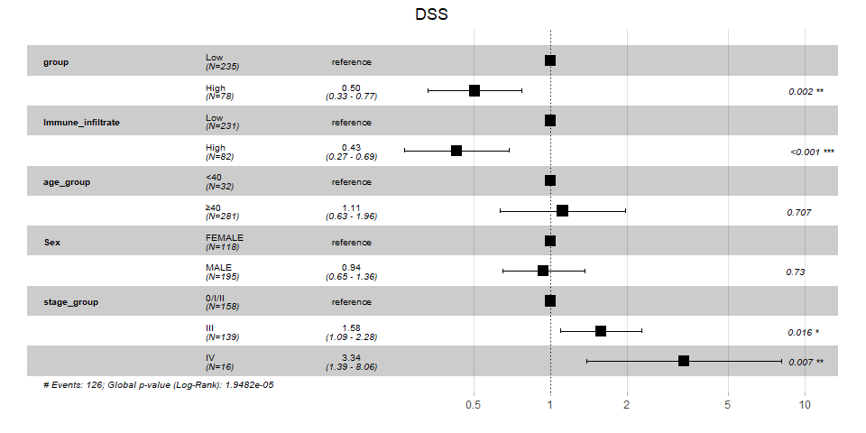<!-- -->

``` r
cox_mod_OS <- coxph(
  Surv(OS.years_censored, OS_censored) ~ 
    group     + 
    Immune_infiltrate +
    age_group   + 
    Sex      + 
    stage_group,
  data = clin_final2
)

summary(cox_mod_OS)
```

    ## Call:
    ## coxph(formula = Surv(OS.years_censored, OS_censored) ~ group + 
    ##     Immune_infiltrate + age_group + Sex + stage_group, data = clin_final2)
    ## 
    ##   n= 307, number of events= 144 
    ##    (6 observations deleted due to missingness)
    ## 
    ##                           coef exp(coef) se(coef)      z Pr(>|z|)    
    ## groupHigh             -0.63802   0.52834  0.20107 -3.173 0.001508 ** 
    ## Immune_infiltrateHigh -0.81479   0.44273  0.22555 -3.612 0.000303 ***
    ## age_group≥40           0.24527   1.27797  0.28543  0.859 0.390177    
    ## SexMALE               -0.08658   0.91706  0.17756 -0.488 0.625812    
    ## stage_groupIII         0.50860   1.66295  0.17565  2.896 0.003785 ** 
    ## stage_groupIV          1.08506   2.95963  0.44343  2.447 0.014405 *  
    ## ---
    ## Signif. codes:  0 '***' 0.001 '**' 0.01 '*' 0.05 '.' 0.1 ' ' 1
    ## 
    ##                       exp(coef) exp(-coef) lower .95 upper .95
    ## groupHigh                0.5283     1.8927    0.3563    0.7835
    ## Immune_infiltrateHigh    0.4427     2.2587    0.2845    0.6889
    ## age_group≥40             1.2780     0.7825    0.7304    2.2360
    ## SexMALE                  0.9171     1.0904    0.6475    1.2988
    ## stage_groupIII           1.6630     0.6013    1.1786    2.3463
    ## stage_groupIV            2.9596     0.3379    1.2411    7.0580
    ## 
    ## Concordance= 0.64  (se = 0.024 )
    ## Likelihood ratio test= 34.56  on 6 df,   p=5e-06
    ## Wald test            = 31.92  on 6 df,   p=2e-05
    ## Score (logrank) test = 33.09  on 6 df,   p=1e-05

``` r
ggforest(cox_mod_OS, data=clin_final2, main = "OS")
```

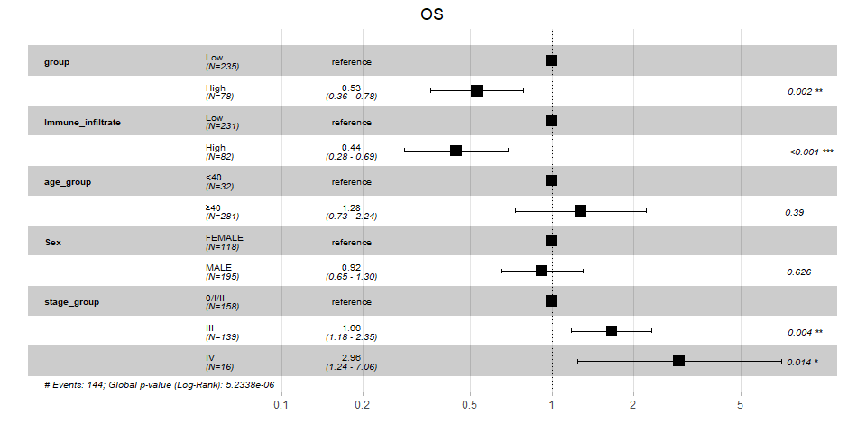<!-- -->

``` r
cox_mod_PFS <- coxph(
  Surv(PFI.years_censored, PFI_censored) ~ 
    group     + 
    Immune_infiltrate +
    age_group   + 
    Sex      + 
    stage_group,
  data = clin_final2
)

summary(cox_mod_PFS)
```

    ## Call:
    ## coxph(formula = Surv(PFI.years_censored, PFI_censored) ~ group + 
    ##     Immune_infiltrate + age_group + Sex + stage_group, data = clin_final2)
    ## 
    ##   n= 308, number of events= 217 
    ##    (5 observations deleted due to missingness)
    ## 
    ##                           coef exp(coef) se(coef)      z Pr(>|z|)    
    ## groupHigh             -0.33240   0.71720  0.15902 -2.090   0.0366 *  
    ## Immune_infiltrateHigh -0.05763   0.94400  0.15292 -0.377   0.7063    
    ## age_group≥40           0.12766   1.13616  0.21518  0.593   0.5530    
    ## SexMALE               -0.13814   0.87098  0.14286 -0.967   0.3336    
    ## stage_groupIII         0.57575   1.77846  0.14233  4.045 5.23e-05 ***
    ## stage_groupIV          1.31472   3.72370  0.32740  4.016 5.93e-05 ***
    ## ---
    ## Signif. codes:  0 '***' 0.001 '**' 0.01 '*' 0.05 '.' 0.1 ' ' 1
    ## 
    ##                       exp(coef) exp(-coef) lower .95 upper .95
    ## groupHigh                0.7172     1.3943    0.5251    0.9795
    ## Immune_infiltrateHigh    0.9440     1.0593    0.6995    1.2739
    ## age_group≥40             1.1362     0.8802    0.7452    1.7322
    ## SexMALE                  0.8710     1.1481    0.6583    1.1524
    ## stage_groupIII           1.7785     0.5623    1.3455    2.3507
    ## stage_groupIV            3.7237     0.2686    1.9602    7.0738
    ## 
    ## Concordance= 0.638  (se = 0.02 )
    ## Likelihood ratio test= 28.2  on 6 df,   p=9e-05
    ## Wald test            = 29.38  on 6 df,   p=5e-05
    ## Score (logrank) test = 30.57  on 6 df,   p=3e-05

``` r
ggforest(cox_mod_PFS, data=clin_final2, main = "PFS")
```

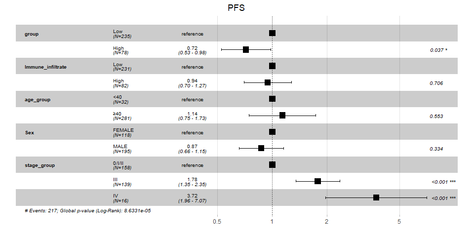<!-- -->

## Association with TMB

``` r
# query <- GDCquery(project = "TCGA-SKCM",
#                   data.category = "Simple Nucleotide Variation",
#                   data.type     = "Masked Somatic Mutation"
#                   )
# GDCdownload(query = query, directory = "../controlled_data/GDCdata/")
# maf_sckm <- GDCprepare(query, directory = "../controlled_data/GDCdata")
load("../controlled_data/GDCdata/TCGA-SKCM/maf_skcm.RData")
total_muts <- as.data.frame(table(maf_sckm$Tumor_Sample_Barcode))

colnames(total_muts) <- c("Tumor_Sample_Barcode", "Mutations")

total_muts$bcr_patient_barcode  <- TCGAutils::TCGAbarcode(as.character(total_muts$Tumor_Sample_Barcode),participant = T)

clin_final3 <-merge(clin_final2, total_muts,by = "bcr_patient_barcode") 
clin_final3$TMB <- as.factor(ifelse(clin_final3$Mutations < quantile(clin_final3$Mutations, 0.5), "Low", "High"))
clin_final3$TMB <- relevel(clin_final3$TMB, ref = "Low")
cox_mod <- coxph(
  Surv(DSS.years_censored, DSS_censored) ~ 
    group     + 
    TMB +
    Immune_infiltrate +
    age_group   + 
    Sex      + 
    stage_group,
  data = clin_final3
)

# 3) Summarize and plot
summary(cox_mod)
```

    ## Call:
    ## coxph(formula = Surv(DSS.years_censored, DSS_censored) ~ group + 
    ##     TMB + Immune_infiltrate + age_group + Sex + stage_group, 
    ##     data = clin_final3)
    ## 
    ##   n= 301, number of events= 127 
    ##    (11 observations deleted due to missingness)
    ## 
    ##                           coef exp(coef) se(coef)      z Pr(>|z|)    
    ## groupHigh             -0.68612   0.50353  0.21723 -3.158  0.00159 ** 
    ## TMBHigh               -0.47036   0.62477  0.19060 -2.468  0.01359 *  
    ## Immune_infiltrateHigh -0.97137   0.37856  0.24809 -3.915 9.03e-05 ***
    ## age_group≥40           0.20278   1.22481  0.29084  0.697  0.48565    
    ## SexMALE                0.06249   1.06448  0.19648  0.318  0.75045    
    ## stage_groupIII         0.42695   1.53258  0.18857  2.264  0.02357 *  
    ## stage_groupIV          1.21524   3.37111  0.45112  2.694  0.00706 ** 
    ## ---
    ## Signif. codes:  0 '***' 0.001 '**' 0.01 '*' 0.05 '.' 0.1 ' ' 1
    ## 
    ##                       exp(coef) exp(-coef) lower .95 upper .95
    ## groupHigh                0.5035     1.9860    0.3289    0.7708
    ## TMBHigh                  0.6248     1.6006    0.4300    0.9077
    ## Immune_infiltrateHigh    0.3786     2.6416    0.2328    0.6156
    ## age_group≥40             1.2248     0.8165    0.6926    2.1659
    ## SexMALE                  1.0645     0.9394    0.7243    1.5645
    ## stage_groupIII           1.5326     0.6525    1.0590    2.2179
    ## stage_groupIV            3.3711     0.2966    1.3924    8.1615
    ## 
    ## Concordance= 0.659  (se = 0.025 )
    ## Likelihood ratio test= 39.24  on 7 df,   p=2e-06
    ## Wald test            = 36.38  on 7 df,   p=6e-06
    ## Score (logrank) test = 37.79  on 7 df,   p=3e-06

``` r
ggforest(cox_mod, data=clin_final3)
```

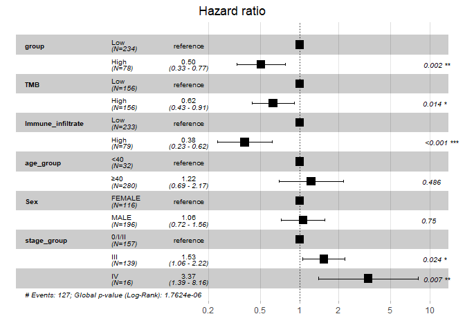<!-- -->

## Baseline characteristics according to HLA group

``` r
library(compareGroups)
```

    ## 
    ## Attaching package: 'compareGroups'

    ## The following object is masked from 'package:TCGAbiolinks':
    ## 
    ##     getResults

``` r
df <- clin_final2 %>%
  transmute(group,
            is_primary = case_when(
              definition == "Primary solid Tumor" ~ "Primary",
              definition %in% c("not reported", NA) ~ NA_character_,
              definition == "Metastatic" ~ "Metastatic"
            )) %>%
  dplyr::filter(!is.na(is_primary), !is.na(group))

tab <- table(df$group, df$is_primary)
tab
```

    ##       
    ##        Metastatic Primary
    ##   Low         185      50
    ##   High         70       8

``` r
# Fisher's exact (robust for small counts)
ft <- fisher.test(tab)
ft
```

    ## 
    ##  Fisher's Exact Test for Count Data
    ## 
    ## data:  tab
    ## p-value = 0.0296
    ## alternative hypothesis: true odds ratio is not equal to 1
    ## 95 percent confidence interval:
    ##  0.1651068 0.9612217
    ## sample estimates:
    ## odds ratio 
    ##  0.4238603

``` r
# Also show proportions by group
prop_tbl <- prop.table(tab, margin = 1) %>% round(3)
prop_tbl
```

    ##       
    ##        Metastatic Primary
    ##   Low       0.787   0.213
    ##   High      0.897   0.103

``` r
#GLM to make adjusted comparison
addmargins(tab)
```

    ##       
    ##        Metastatic Primary Sum
    ##   Low         185      50 235
    ##   High         70       8  78
    ##   Sum         255      58 313

``` r
prop.table(tab, 1)
```

    ##       
    ##        Metastatic   Primary
    ##   Low   0.7872340 0.2127660
    ##   High  0.8974359 0.1025641

``` r
# risk difference (absolute difference in proportions)
rd <- prop_tbl["High","Metastatic"] - prop_tbl["Low","Metastatic"]  # High - Low
rd  # ≈ -0.116  (≈ –11.6 percentage points)
```

    ## [1] 0.11

``` r
# Phi coefficient (effect size for 2x2)
phi <- psych::phi(tab)  # needs psych package
phi
```

    ## [1] -0.12

``` r
library(binom)
prop_df <- df %>%
  dplyr::count(group, is_primary) %>%
  pivot_wider(names_from = is_primary, values_from = n, values_fill = 0) %>%
  dplyr::rename(Metastatic = `Metastatic`, Primary = `Primary`) %>%
  mutate(n = Metastatic + Primary) %>%
  rowwise() %>%
  mutate(binom = list(binom.confint(x = Metastatic, n = n, methods = "wilson"))) %>%
  unnest(binom, names_sep = "_") %>%      # <-- avoids name collision
  transmute(group,
            p   = binom_mean,                   # from binom_*
            lwr = binom_lower,
            upr = binom_upper,
            n)

# y-position for the bracket (slightly above the tallest CI bar)
y_bracket <- max(prop_df$upr) * 1.08

# Build the p-value data frame for ggpubr
pdat <- data.frame(
  group1 = "Low",
  group2 = "High",
  y.position = y_bracket,
  p = ft$p.value,
  p.signif = symnum(ft$p.value, corr = FALSE, na = FALSE,
                    cutpoints = c(0, .001, .01, .05, .1, 1),
                    symbols = c("***","**","*",".","ns"))
)

ggplot(prop_df, aes(group, p, fill = group)) +
  geom_col(width = .6, color = "grey20") +
  geom_errorbar(aes(ymin = lwr, ymax = upr), width = .15, linewidth = .6) +
  scale_y_continuous(labels = scales::percent_format(accuracy = 1),
                     limits = c(0, max(prop_df$upr)*1.2)) +
  scale_fill_manual(values = c(Low = "#0384fc", High = "red")) +
  labs(title = "Proportion of Metastatic tumors by group",
       x = NULL, y = "Primary (proportion)") +
  theme_classic() + theme(legend.position = "none") +
  ggpubr::stat_pvalue_manual(pdat, label = "p.signif", tip.length = 0.01)
```

<!-- -->

## Larger multivariate model (immune infiltration, CIITA, and single HLA-II isotypes)

``` r
# Test with Immune infiltration, CIITA, HLA-DRA, HLA-DP, HLA-DQ
###HLA-DR
grep("HLA-DR", rownames(rank_data), value=T)
```

    ## ENSG00000196126 ENSG00000198502 ENSG00000204287 
    ##      "HLA-DRB1"      "HLA-DRB5"       "HLA-DRA"

``` r
# compute simple singscore
scores <- simpleScore(rank_data,
                      upSet   = unique(grep("HLA-DR", rownames(rank_data), value=T)))
rownames(scores) <- gsub(x= rownames(scores), pattern = "\\.", replacement = "-")
scores$sample <- rownames(scores)
scores <- subset(scores, sample %in% clin_final$sample)

clin_final$HLADR_score <- scores$TotalScore[
  match(clin_final$sample, scores$sample)
]
###HLA-DQ
scores <- simpleScore(rank_data,
                      upSet   = unique(grep("HLA-DQ", rownames(rank_data), value = T)))
rownames(scores) <- gsub(x= rownames(scores), pattern = "\\.", replacement = "-")
scores$sample <- rownames(scores)
scores <- subset(scores, sample %in% clin_final$sample)

clin_final$HLADQ_score <- scores$TotalScore[
  match(clin_final$sample, scores$sample)
]
###HLA-DP
scores <- simpleScore(rank_data,
                      upSet   = unique(grep("HLA-DP", rownames(rank_data), value = T)))
rownames(scores) <- gsub(x= rownames(scores), pattern = "\\.", replacement = "-")
scores$sample <- rownames(scores)
scores <- subset(scores, sample %in% clin_final$sample)

clin_final$HLADP_score <- scores$TotalScore[
  match(clin_final$sample, scores$sample)
]

###HLA-DP
scores <- simpleScore(rank_data,
                      upSet   = unique(grep("CIITA", rownames(rank_data), value = T)))
rownames(scores) <- gsub(x= rownames(scores), pattern = "\\.", replacement = "-")
scores$sample <- rownames(scores)
scores <- subset(scores, sample %in% clin_final$sample)

clin_final$CIITA_score <- scores$TotalScore[
  match(clin_final$sample, scores$sample)
]

clin_final <- clin_final %>%
  mutate(group_DR = if_else(HLADR_score >= 
                           quantile(HLADR_score, 0.75),
                         "High","Low"))
clin_final <- clin_final %>%
  mutate(group_DP = if_else(HLADP_score >= 
                           quantile(HLADP_score, 0.75),
                         "High","Low"))
clin_final <- clin_final %>%
  mutate(group_DQ = if_else(HLADQ_score >= 
                           quantile(HLADQ_score, 0.75),
                         "High","Low"))

clin_final <- clin_final %>%
  mutate(CIITA_group = if_else(CIITA_score >= 
                              quantile(CIITA_score, 0.75),
                            "High","Low"))
clin_final <- clin_final %>%
  mutate(Immune_infiltrate = if_else(immune_score >= 
                              quantile(immune_score, 0.75),
                            "High","Low"))

fit <- survfit(
  Surv(DSS.years_censored, DSS_censored) ~ Immune_infiltrate,
  data = clin_final
)

# Plot DSS for immune infiltration groups
ggsurvplot(
  fit,
  data       = clin_final,
  pval       = TRUE,
  risk.table = TRUE,
) + labs(
  title="Survival in Immune infiltration groups"
)
```

    ## NULL

``` r
clin_final2 <- clin_final %>%
  mutate(
    Age_group = if_else(age_at_diagnosis/365 < 40, "<40", "≥40"),
    Stage_group = case_when(
      ajcc_pathologic_tumor_stage %in% c("Stage 0", "I/II NOS",
                                   "Stage I","Stage IA","Stage IB",
                                   "Stage II","Stage IIA","Stage IIB","Stage IIC")
      ~ "0/I/II",
      ajcc_pathologic_tumor_stage %in% c("Stage III","Stage IIIA","Stage IIIB","Stage IIIC")
      ~ "III",
      ajcc_pathologic_tumor_stage == "Stage IV" 
      ~ "IV",
      TRUE ~ NA_character_
    ),
    Immune_infiltrate = if_else(condition = (immune_score >= quantile(immune_score, 0.75)),
                            "High","Low")
  ) %>%
  mutate(
    Age_group   = factor(Age_group,   levels=c("<40","≥40")),
    Stage_group = factor(Stage_group, levels=c("0/I/II","III","IV")),
    Immune_infiltrate = factor(Immune_infiltrate, levels = c("Low", "High")),
    Sex = as.factor(gender)
  ) %>%
  dplyr::filter(!is.na(Age_group) & !is.na(Stage_group))

clin_final2$HLA_const <- as.factor(clin_final2$group)
clin_final2$HLA_const <- relevel(clin_final2$HLA_const, ref = "Low")
clin_final2$group_DR <- as.factor(clin_final2$group_DR)
clin_final2$group_DR <- relevel(clin_final2$group_DR, ref = "Low")
clin_final2$group_DP <- as.factor(clin_final2$group_DP)
clin_final2$group_DP <- relevel(clin_final2$group_DP, ref = "Low")
clin_final2$group_DQ <- as.factor(clin_final2$group_DQ)
clin_final2$group_DQ <- relevel(clin_final2$group_DQ, ref = "Low")
clin_final2$Immune_infiltrate <- as.factor(clin_final2$Immune_infiltrate)
clin_final2$Immune_infiltrate <- relevel(clin_final2$Immune_infiltrate, ref = "Low")
# clin_final2$Sex <- as.factor(clin_final2$Sex)
# clin_final2$Sex <- relevel(clin_final2$Sex, ref = "MALE")
clin_final2$CIITA_group <- as.factor(clin_final2$CIITA_group)
clin_final2$CIITA_group <- relevel(clin_final2$CIITA_group, ref = "Low")

# Fit the Cox model with the new categorical vars
cox_mod <- coxph(
  Surv(DSS.years_censored, DSS_censored) ~ 
    HLA_const     + 
    Immune_infiltrate +
    Age_group   + 
    Sex      + 
    Stage_group,
  data = clin_final2
)

# Summarize and plot
summary(cox_mod)
```

    ## Call:
    ## coxph(formula = Surv(DSS.years_censored, DSS_censored) ~ HLA_const + 
    ##     Immune_infiltrate + Age_group + Sex + Stage_group, data = clin_final2)
    ## 
    ##   n= 302, number of events= 126 
    ##    (11 observations deleted due to missingness)
    ## 
    ##                           coef exp(coef) se(coef)      z Pr(>|z|)    
    ## HLA_constHigh         -0.68571   0.50373  0.21670 -3.164 0.001554 ** 
    ## Immune_infiltrateHigh -0.85033   0.42727  0.24105 -3.528 0.000419 ***
    ## Age_group≥40           0.10808   1.11414  0.28796  0.375 0.707418    
    ## SexMALE               -0.06551   0.93659  0.18961 -0.346 0.729705    
    ## Stage_groupIII         0.45564   1.57718  0.18826  2.420 0.015509 *  
    ## Stage_groupIV          1.20673   3.34253  0.44931  2.686 0.007237 ** 
    ## ---
    ## Signif. codes:  0 '***' 0.001 '**' 0.01 '*' 0.05 '.' 0.1 ' ' 1
    ## 
    ##                       exp(coef) exp(-coef) lower .95 upper .95
    ## HLA_constHigh            0.5037     1.9852    0.3294    0.7703
    ## Immune_infiltrateHigh    0.4273     2.3404    0.2664    0.6853
    ## Age_group≥40             1.1141     0.8976    0.6336    1.9591
    ## SexMALE                  0.9366     1.0677    0.6459    1.3581
    ## Stage_groupIII           1.5772     0.6340    1.0905    2.2810
    ## Stage_groupIV            3.3425     0.2992    1.3856    8.0636
    ## 
    ## Concordance= 0.638  (se = 0.026 )
    ## Likelihood ratio test= 31.6  on 6 df,   p=2e-05
    ## Wald test            = 29.46  on 6 df,   p=5e-05
    ## Score (logrank) test = 30.61  on 6 df,   p=3e-05

``` r
ggforest(cox_mod, data=clin_final2, main = "Multivariate Cox - HLACONST+ and Immune infiltrate")
```

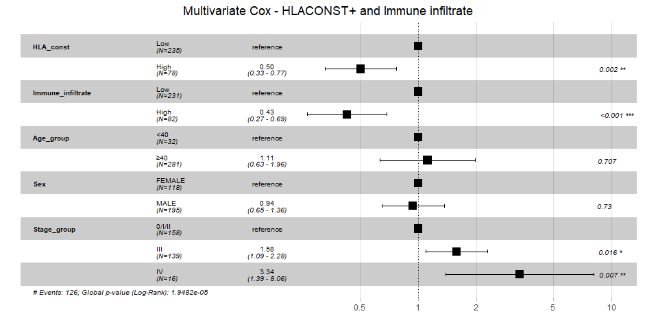<!-- -->

``` r
# Check proportional‑hazards assumption
cox.zph(cox_mod)
```

    ##                   chisq df    p
    ## HLA_const         0.783  1 0.38
    ## Immune_infiltrate 0.288  1 0.59
    ## Age_group         0.245  1 0.62
    ## Sex               1.930  1 0.16
    ## Stage_group       2.439  2 0.30
    ## GLOBAL            5.843  6 0.44

``` r
# Fit the Cox model with the new categorical vars
cox_mod_CIITA <- coxph(
  Surv(DSS.years_censored, DSS_censored) ~ 
    HLA_const     + 
    Immune_infiltrate +
    CIITA_group +
    Age_group   + 
    Sex      + 
    Stage_group,
  data = clin_final2
)

# Summarize and plot
summary(cox_mod_CIITA)
```

    ## Call:
    ## coxph(formula = Surv(DSS.years_censored, DSS_censored) ~ HLA_const + 
    ##     Immune_infiltrate + CIITA_group + Age_group + Sex + Stage_group, 
    ##     data = clin_final2)
    ## 
    ##   n= 302, number of events= 126 
    ##    (11 observations deleted due to missingness)
    ## 
    ##                           coef exp(coef) se(coef)      z Pr(>|z|)    
    ## HLA_constHigh         -0.71466   0.48936  0.21666 -3.299 0.000972 ***
    ## Immune_infiltrateHigh -0.43375   0.64808  0.27523 -1.576 0.115035    
    ## CIITA_groupHigh       -0.79010   0.45380  0.28529 -2.769 0.005615 ** 
    ## Age_group≥40           0.16607   1.18066  0.28830  0.576 0.564597    
    ## SexMALE               -0.04111   0.95973  0.18971 -0.217 0.828458    
    ## Stage_groupIII         0.47743   1.61192  0.18918  2.524 0.011614 *  
    ## Stage_groupIV          1.19757   3.31207  0.45006  2.661 0.007793 ** 
    ## ---
    ## Signif. codes:  0 '***' 0.001 '**' 0.01 '*' 0.05 '.' 0.1 ' ' 1
    ## 
    ##                       exp(coef) exp(-coef) lower .95 upper .95
    ## HLA_constHigh            0.4894     2.0435    0.3200    0.7482
    ## Immune_infiltrateHigh    0.6481     1.5430    0.3779    1.1115
    ## CIITA_groupHigh          0.4538     2.2036    0.2594    0.7938
    ## Age_group≥40             1.1807     0.8470    0.6710    2.0774
    ## SexMALE                  0.9597     1.0420    0.6617    1.3920
    ## Stage_groupIII           1.6119     0.6204    1.1125    2.3355
    ## Stage_groupIV            3.3121     0.3019    1.3709    8.0019
    ## 
    ## Concordance= 0.66  (se = 0.025 )
    ## Likelihood ratio test= 40.19  on 7 df,   p=1e-06
    ## Wald test            = 35.63  on 7 df,   p=8e-06
    ## Score (logrank) test = 37.58  on 7 df,   p=4e-06

``` r
ggforest(cox_mod_CIITA, data=clin_final2, main = "Multivariate Cox - Complete model")
```

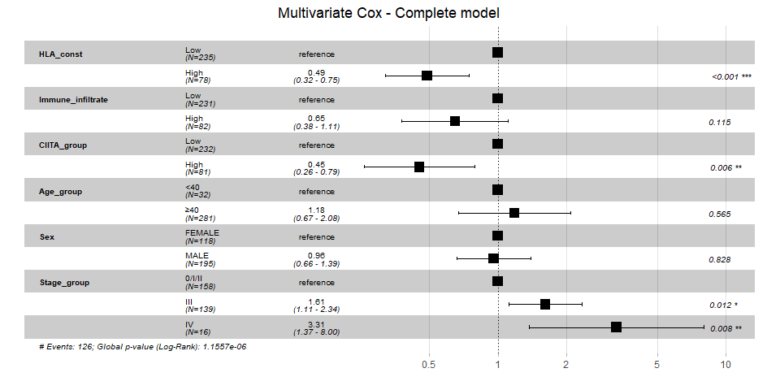<!-- -->

``` r
cox_mod_complete <- coxph(
  Surv(DSS.years_censored, DSS_censored) ~ 
    HLA_const     + 
    Immune_infiltrate +
    CIITA_group +
    group_DR+
    group_DP+
    group_DQ+
    Age_group   + 
    Sex      + 
    Stage_group,
  data = clin_final2
)

# Summarize and plot
summary(cox_mod_complete)
```

    ## Call:
    ## coxph(formula = Surv(DSS.years_censored, DSS_censored) ~ HLA_const + 
    ##     Immune_infiltrate + CIITA_group + group_DR + group_DP + group_DQ + 
    ##     Age_group + Sex + Stage_group, data = clin_final2)
    ## 
    ##   n= 302, number of events= 126 
    ##    (11 observations deleted due to missingness)
    ## 
    ##                           coef exp(coef) se(coef)      z Pr(>|z|)    
    ## HLA_constHigh         -0.72732   0.48320  0.21806 -3.335 0.000852 ***
    ## Immune_infiltrateHigh -0.15237   0.85867  0.32724 -0.466 0.641495    
    ## CIITA_groupHigh       -0.35063   0.70424  0.32204 -1.089 0.276252    
    ## group_DRHigh          -0.71942   0.48703  0.31704 -2.269 0.023259 *  
    ## group_DPHigh          -0.46866   0.62584  0.33747 -1.389 0.164906    
    ## group_DQHigh          -0.04007   0.96072  0.32712 -0.123 0.902497    
    ## Age_group≥40           0.21228   1.23650  0.28953  0.733 0.463431    
    ## SexMALE               -0.11822   0.88850  0.19330 -0.612 0.540796    
    ## Stage_groupIII         0.46621   1.59394  0.19031  2.450 0.014293 *  
    ## Stage_groupIV          1.32121   3.74796  0.45350  2.913 0.003576 ** 
    ## ---
    ## Signif. codes:  0 '***' 0.001 '**' 0.01 '*' 0.05 '.' 0.1 ' ' 1
    ## 
    ##                       exp(coef) exp(-coef) lower .95 upper .95
    ## HLA_constHigh            0.4832     2.0695    0.3151    0.7409
    ## Immune_infiltrateHigh    0.8587     1.1646    0.4521    1.6307
    ## CIITA_groupHigh          0.7042     1.4200    0.3746    1.3239
    ## group_DRHigh             0.4870     2.0533    0.2616    0.9066
    ## group_DPHigh             0.6258     1.5979    0.3230    1.2126
    ## group_DQHigh             0.9607     1.0409    0.5060    1.8241
    ## Age_group≥40             1.2365     0.8087    0.7010    2.1809
    ## SexMALE                  0.8885     1.1255    0.6083    1.2978
    ## Stage_groupIII           1.5939     0.6274    1.0977    2.3145
    ## Stage_groupIV            3.7480     0.2668    1.5409    9.1163
    ## 
    ## Concordance= 0.669  (se = 0.025 )
    ## Likelihood ratio test= 50.29  on 10 df,   p=2e-07
    ## Wald test            = 42.01  on 10 df,   p=7e-06
    ## Score (logrank) test = 44.77  on 10 df,   p=2e-06

``` r
ggforest(cox_mod_complete, data=clin_final2, main = "Multivariate Cox - Complete model")
```

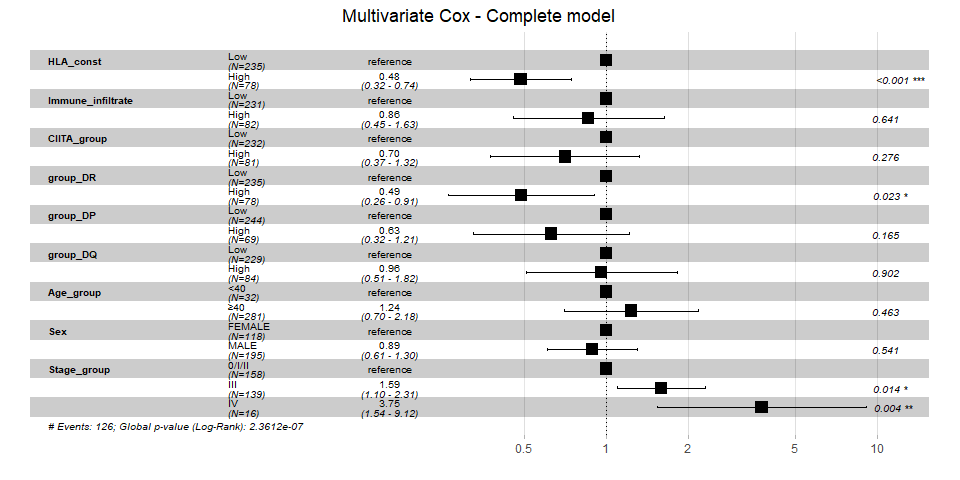<!-- -->

``` r
# Check proportional‑hazards assumption
cox.zph(cox_mod_complete)
```

    ##                    chisq df    p
    ## HLA_const         1.1121  1 0.29
    ## Immune_infiltrate 0.3918  1 0.53
    ## CIITA_group       0.1068  1 0.74
    ## group_DR          0.8086  1 0.37
    ## group_DP          0.1620  1 0.69
    ## group_DQ          0.2868  1 0.59
    ## Age_group         0.0668  1 0.80
    ## Sex               1.7194  1 0.19
    ## Stage_group       2.8799  2 0.24
    ## GLOBAL            8.0100 10 0.63

``` r
# show collinearity between immune infiltrate, CIITA and HLAs - simple correlations
vars <- c("score_z","immune_score","CIITA_score","HLADR_score","HLADP_score","HLADQ_score","age_at_diagnosis")
M <- clin_final[, vars]
colnames(M) <- c("Normalized HLA-II score", "Immune infiltrate", "CIITA expression", "HLA-DR expression", "HLA-DP expression", "HLA-DQ expression", "Age")
cors <- cor(M, use="pairwise.complete.obs", method="spearman")
cors
```

    ##                         Normalized HLA-II score Immune infiltrate
    ## Normalized HLA-II score              1.00000000        0.06696443
    ## Immune infiltrate                    0.06696443        1.00000000
    ## CIITA expression                     0.02384562        0.86140723
    ## HLA-DR expression                    0.14790991        0.84812014
    ## HLA-DP expression                    0.09255797        0.80803274
    ## HLA-DQ expression                    0.08184748        0.82421085
    ## Age                                 -0.08728077       -0.07838438
    ##                         CIITA expression HLA-DR expression HLA-DP expression
    ## Normalized HLA-II score      0.023845619        0.14790991        0.09255797
    ## Immune infiltrate            0.861407226        0.84812014        0.80803274
    ## CIITA expression             1.000000000        0.88963375        0.81801820
    ## HLA-DR expression            0.889633753        1.00000000        0.83304466
    ## HLA-DP expression            0.818018203        0.83304466        1.00000000
    ## HLA-DQ expression            0.852662321        0.87129726        0.81644153
    ## Age                          0.006380895       -0.03069411       -0.02149877
    ##                         HLA-DQ expression          Age
    ## Normalized HLA-II score       0.081847481 -0.087280765
    ## Immune infiltrate             0.824210851 -0.078384384
    ## CIITA expression              0.852662321  0.006380895
    ## HLA-DR expression             0.871297259 -0.030694108
    ## HLA-DP expression             0.816441530 -0.021498769
    ## HLA-DQ expression             1.000000000  0.002625298
    ## Age                           0.002625298  1.000000000

``` r
corrplot::corrplot(
  cors,
  method = "color",
  type = "upper",
  order = "hclust",
  addCoef.col = "black",
  tl.col = "black",
  col = colorRampPalette(c("navy", "white", "firebrick3"))(200),
  tl.srt = 45,
  diag = T
)
```

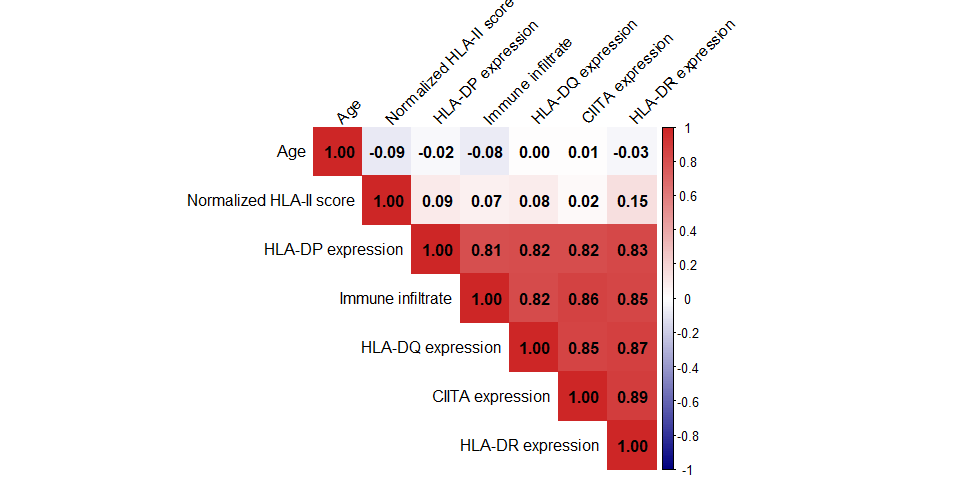<!-- -->

``` r
# collinearity in the design matrix
X <- model.matrix(cox_mod_complete)
X <- X[, colnames(X) != "(Intercept)", drop=FALSE]

# Remove columns with zero variance (can happen with sparse factor levels)
X <- X[, apply(X, 2, sd, na.rm=TRUE) > 0, drop=FALSE]

# Correlation matrix among columns
R <- cor(X, use="pairwise.complete.obs")

# VIF = diagonal of inverse correlation matrix
VIF <- diag(solve(R))
sort(VIF, decreasing = TRUE)
```

    ##       CIITA_groupHigh          group_DQHigh Immune_infiltrateHigh 
    ##              2.476327              2.463228              2.079906 
    ##          group_DRHigh          group_DPHigh         Stage_groupIV 
    ##              2.012957              1.703123              1.070063 
    ##        Stage_groupIII               SexMALE          Age_group≥40 
    ##              1.055064              1.033849              1.028082 
    ##         HLA_constHigh 
    ##              1.016517

## Compare the different models (Exploratory, not included)

``` r
library(survival)
library(broom)
library(dplyr)
library(ggplot2)
library(forcats)


# --- keep the same adjustments you were using
controls <- c("Age_group","Sex","Stage_group")

mk_mod <- function(rhs_vars) {
  rhs <- paste(c(rhs_vars, controls), collapse = " + ")
  coxph(as.formula(paste("Surv(DSS.years_censored, DSS_censored) ~", rhs)),
        data = clin_final2)
}

# --- your 4 models
mods <- list(
  "HLA+Immune infiltrate"        = mk_mod(c("HLA_const","Immune_infiltrate")),
  "HLA+CIITA"      = mk_mod(c("HLA_const","CIITA_group")),
  "Immune infiltrate+CIITA"      = mk_mod(c("Immune_infiltrate","CIITA_group")),
  "HLA+Immune infiltrate+CIITA"  = mk_mod(c("HLA_const","Immune_infiltrate","CIITA_group"))
)

# --- build a mapping of the term names used in the model for each variable

target_vars <- c("HLA_const","Immune_infiltrate","CIITA_group")
pretty_var  <- c(HLA_const="HLA Const+",
                 Immune_infiltrate="Immune infiltration",
                 CIITA_group="CIITA")

var_map <- bind_rows(lapply(target_vars, function(v){
  x <- clin_final2[[v]]
  if(!is.factor(x) || length(levels(x)) < 2)
    stop(sprintf("%s should be a 2+ level factor with first level = reference", v))
  ref  <- levels(x)[1]
  alt  <- levels(x)[2]              
  tibble(
    variable = v,
    term     = paste0(v, alt),      
    label    = sprintf("%s (%s vs %s)", pretty_var[[v]], alt, ref)
  )
}))

# --- tidy all models and keep only the 3 variables of interest
td <- bind_rows(lapply(names(mods), function(mn)
  broom::tidy(mods[[mn]], conf.int = TRUE, exponentiate = TRUE) |>
    mutate(model = mn)
)) |>
  inner_join(var_map, by = "term") |>
  transmute(
    var   = factor(label,
                   levels = sprintf("%s (%s vs %s)",
                                    pretty_var[target_vars],
                                    levels(clin_final2[[target_vars[1]]])[2],  
                                    levels(clin_final2[[target_vars[1]]])[1])),
    model = factor(model, levels = c("HLA+Immune infiltrate","HLA+CIITA","Immune infiltrate+CIITA","HLA+Immune infiltrate+CIITA")),
    HR    = estimate, lo = conf.low, hi = conf.high, p = p.value
  ) |>
  mutate(sig = p < 0.05)

# --- guard against zeros on log scale
td <- dplyr::filter(td, HR > 0, lo > 0, hi > 0)

# dynamic x-limits (log scale)
x_breaks <- c(0.25, 0.5, 1, 2, 4, 8)
x_min <- max(min(td$lo, na.rm = TRUE) * 0.8, min(x_breaks))
x_max <- max(td$hi, na.rm = TRUE) * 1.2

# --- horizontal comparison forest (one facet per variable)
ggplot(td, aes(y = model)) +
  facet_grid(var ~ ., switch = "y") +
  ggplot2::annotate("rect", xmin = x_min, xmax = 1, ymin = -Inf, ymax = Inf, alpha = 0.06) +
  geom_vline(xintercept = 1, linetype = 2) +
  geom_segment(aes(x = lo, xend = hi, yend = model, color = model), linewidth = 0.9) +
  geom_point(aes(x = HR, color = model, fill = sig, shape = sig), size = 2.8) +
  scale_shape_manual(values = c(`TRUE` = 21, `FALSE` = 21), guide = "none") +
  scale_fill_manual(values  = c(`TRUE` = "black", `FALSE` = NA), guide = "none") +
  labs(x = "Hazard ratio (log scale)", y = NULL,
       title = "Key covariates across models") +
  theme_minimal(base_size = 12) +
  theme(panel.grid.minor = element_blank(),
        panel.grid.major.y = element_blank(),
        strip.placement = "outside",
        strip.text.y.left = element_text(angle = 0, hjust = 1),
        legend.position = "right")
```

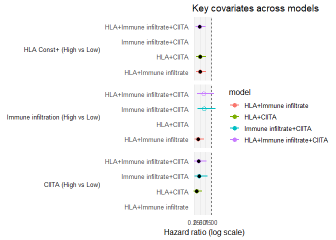<!-- -->

``` r
mod_base <- mods[["HLA+Immune infiltrate"]]
mod_full <- mods[["HLA+Immune infiltrate+CIITA"]]

lr <- anova(mod_base, mod_full, test = "LRT")
lr_df <- as.data.frame(lr, stringsAsFactors = FALSE)

# Find columns safely
chi_col <- grep("Chisq", names(lr_df), value = TRUE)[1]
p_col   <- grep("^Pr\\(", names(lr_df), value = TRUE)[1]  # matches "Pr(>|Chi|)"
df_col  <- grep("^Df$",  names(lr_df), value = TRUE)[1]

chi   <- as.numeric(lr_df[[chi_col]][2])
p_LRT <- as.numeric(lr_df[[p_col]][2])
df_dx <- as.integer(lr_df[[df_col]][2])

ll_base <- as.numeric(logLik(mod_base))
ll_full <- as.numeric(logLik(mod_full))
df_base <- attr(logLik(mod_base), "df")
df_full <- attr(logLik(mod_full), "df")

chi   <- 2 * (ll_full - ll_base)
df_dx <- df_full - df_base
p_LRT <- pchisq(chi, df = df_dx, lower.tail = FALSE)

cap <- sprintf("Adding CIITA to HLA+Immune_infiltrate does not improve fit (LRT Δχ²=%.2f, df=%d, p=%s).",
               chi, df_dx,
               ifelse(p_LRT < 0.001, "<0.001", formatC(p_LRT, format="f", digits=3)))
cap
```

    ## [1] "Adding CIITA to HLA+Immune_infiltrate does not improve fit (LRT Δχ²=8.60, df=1, p=0.003)."

## Compare different HLA-II isotypes

``` r
# Terms to keep (adjust if your term names differ)
keep_terms <- c("group_DRHigh", "group_DPHigh", "group_DQHigh")

td <- broom::tidy(cox_mod_complete, exponentiate = TRUE, conf.int = TRUE) %>%
  dplyr::filter(term %in% keep_terms) %>%
  dplyr::mutate(
    isotype = case_when(
      term == "group_DRHigh" ~ "HLA-DR (High vs Low)",
      term == "group_DPHigh" ~ "HLA-DP (High vs Low)",
      term == "group_DQHigh" ~ "HLA-DQ (High vs Low)",
      TRUE ~ term
    ),
    # Optional: significance label
    p_label = case_when(
      p.value < 0.001 ~ "p<0.001",
      p.value < 0.01  ~ "p<0.01",
      p.value < 0.05  ~ "p<0.05",
      TRUE            ~ paste0("p=", formatC(p.value, digits = 2, format = "f"))
    )
  ) %>%
  # Put DR on top
  dplyr::mutate(isotype = factor(isotype, levels = c("HLA-DR (High vs Low)",
                                             "HLA-DP (High vs Low)",
                                             "HLA-DQ (High vs Low)"))) %>%
  dplyr::arrange(isotype)

# Choose x-limits that look nice for your effect sizes
xlims <- c(0.2, 2.5)

p <- ggplot(td, aes(x = estimate, y = isotype)) +
  geom_vline(xintercept = 1, linetype = 2) +
  geom_pointrange(aes(xmin = conf.low, xmax = conf.high), linewidth = 0.6) +
  scale_x_log10(limits = xlims) +
  labs(
    x = "Hazard ratio (log scale)",
    y = NULL,
    title = "HLA-II isotype groups (multivariable Cox model)",
    subtitle = "Points = HR; bars = 95% CI"
  ) +
  theme_classic(base_size = 12) +
  theme(
    plot.title.position = "plot",
    axis.text.y = element_text(size = 11)
  ) +
  # p-value text on the right side of each row (optional)
  geom_text(
    aes(x = xlims[2], label = p_label),
    hjust = 1, size = 3.5
  )

p
```

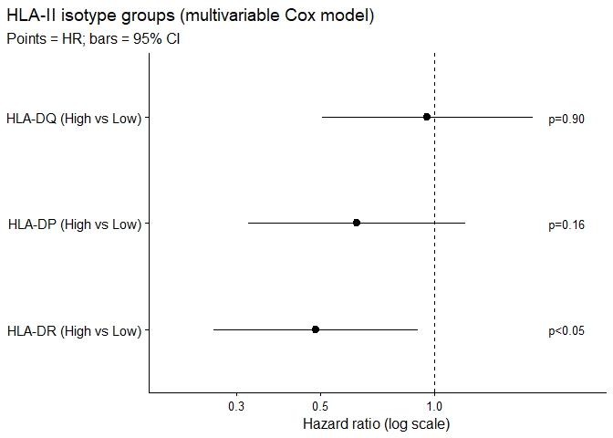<!-- -->

# DE between HLA-II groups in TCGA

## DE

``` r
#change IDs into gene names
hugo <- mapIds(
  org.Hs.eg.db,
  keys      = rownames(counts_mel),
  column    = "SYMBOL",
  keytype   = "ENSEMBL",
  multiVals = "first"
)
```

    ## 'select()' returned 1:many mapping between keys and columns

``` r
# 3. Subset out NAs and rename
keep <- !is.na(hugo)
counts_hugo <- counts_mel[keep, , drop=FALSE]
rownames(counts_hugo) <- hugo[keep]

rownames(counts_hugo)[which(duplicated(rownames(counts_hugo)))]
```

    ## ENSG00000002586 ENSG00000102290 ENSG00000124333 ENSG00000124334 ENSG00000167393 
    ##          "CD99"       "PCDH11X"         "VAMP7"          "IL9R"       "PPP2R3B" 
    ## ENSG00000169084 ENSG00000169093 ENSG00000169100 ENSG00000177023 ENSG00000177243 
    ##         "DHRSX"         "ASMTL"       "SLC25A6"      "DEFB104A"      "DEFB103B" 
    ## ENSG00000177257 ENSG00000178287 ENSG00000178605 ENSG00000182162 ENSG00000182378 
    ##        "DEFB4A"       "SPAG11B"        "GTPBP6"         "P2RY8"        "PLCXD1" 
    ## ENSG00000182484 ENSG00000183336 ENSG00000185176 ENSG00000185203 ENSG00000185291 
    ##        "WASH6P"         "BOLA2"        "AQP12A"        "WASIR1"         "IL3RA" 
    ## ENSG00000185960 ENSG00000186599 ENSG00000187082 ENSG00000188092 ENSG00000196433 
    ##          "SHOX"      "DEFB105A"      "DEFB106A"        "GPR89B"          "ASMT" 
    ## ENSG00000196873 ENSG00000197976 ENSG00000198129 ENSG00000198223 ENSG00000203661 
    ##         "ZNG1B"       "AKAP17A"      "DEFB107A"        "CSF2RA"        "OR2T29" 
    ## ENSG00000205076 ENSG00000205456 ENSG00000205457 ENSG00000205571 ENSG00000205572 
    ##        "LGALS7"       "TP53TG3"       "TP53TG3"          "SMN1"        "SERF1A" 
    ## ENSG00000205755 ENSG00000206567 ENSG00000207430 ENSG00000214717 ENSG00000215372 
    ##         "CRLF2"          "EMC3"  "LOC124900356"         "ZBED1"       "ZNF705G" 
    ## ENSG00000221867 ENSG00000223274 ENSG00000223484 ENSG00000226929 ENSG00000228410 
    ##        "MAGEA3"     "RNA5SP498"       "TRPC6P1"       "CT47A11"       "ELOCP24" 
    ## ENSG00000228696 ENSG00000228741 ENSG00000229232 ENSG00000230373 ENSG00000230542 
    ##        "ARL17A"       "SPATA13"      "KRT18P53"     "GOLGA6L3P"     "LINC00102" 
    ## ENSG00000230549 ENSG00000231364 ENSG00000231887 ENSG00000232832 ENSG00000233050 
    ##       "USP17L1"  "LOC105375358"          "PRH1"     "ANKRD18DP"      "DEFB130A" 
    ## ENSG00000233917 ENSG00000234958 ENSG00000236424 ENSG00000236871 ENSG00000237038 
    ##        "POTEB2"      "FABP5P13"         "TSPY3"     "LINC00106"       "USP17L8" 
    ## ENSG00000237040 ENSG00000237289 ENSG00000237541 ENSG00000238074 ENSG00000238083 
    ##        "DPH3P2"        "CKMT1B"      "HLA-DQA1"         "TSPY1"       "LRRC37A" 
    ## ENSG00000243902 ENSG00000251925 ENSG00000252143 ENSG00000255378 ENSG00000257520 
    ##         "ELFN2"  "LOC124900506"  "LOC124905172"       "PRR23D1"         "SFTA3" 
    ## ENSG00000258724 ENSG00000258992 ENSG00000261480 ENSG00000261509 ENSG00000261832 
    ##         "PINX1"         "TSPY1"       "GOLGA8M"       "TP53TG3"          "CLN3" 
    ## ENSG00000263715 ENSG00000265658 ENSG00000267978 ENSG00000268350 ENSG00000268592 
    ##         "CRHR1"       "MIR3690"        "MAGEA9"       "FAM156A"    "RAET1E-AS1" 
    ## ENSG00000268606 ENSG00000268916 ENSG00000269226 ENSG00000269791 ENSG00000271793 
    ##        "MAGEA2"         "CSAG3"       "TMSB15B"          "SSX4"       "SYNCRIP" 
    ## ENSG00000272342 ENSG00000274611 ENSG00000274862 ENSG00000275163 ENSG00000275219 
    ##     "LINC01115"        "TBC1D3"  "LOC124904138"        "KCNMB2"  "LOC124904138" 
    ## ENSG00000275496 ENSG00000276077 ENSG00000276462 ENSG00000276596 ENSG00000276850 
    ##     "LOC389831"     "LOC389831"     "LINC03025"  "LOC124904138"         "ANXA8" 
    ## ENSG00000277067 ENSG00000277120 ENSG00000277526 ENSG00000277903 ENSG00000278048 
    ##     "LOC389831"       "MIR6089"     "LINC03021"  "LOC124904138"  "LOC124904138" 
    ## ENSG00000278591 ENSG00000278662 ENSG00000278970 ENSG00000280165 ENSG00000280987 
    ##  "LOC124904138"      "GOLGA6L4"         "ZFP62"        "PCDH20"         "MATR3" 
    ## ENSG00000281710 ENSG00000281756 ENSG00000282304 ENSG00000283201 ENSG00000283239 
    ##  "LOC124906377"        "C2-AS1"          "MALL"        "ZNF724"   "KBTBD11-OT1" 
    ## ENSG00000283293 ENSG00000283378 ENSG00000284762 ENSG00000284988 ENSG00000285188 
    ##         "RN7SK"       "CNTNAP3"         "PDE8B"     "LINC02203"         "PDE4C" 
    ## ENSG00000285458 ENSG00000285765 ENSG00000285777 ENSG00000286112 ENSG00000287542 
    ##       "C4orf36"      "FAM90A24"       "ANKRD45"         "KYAT1"         "HERC3" 
    ## ENSG00000288674 
    ##         "PSEN2"

``` r
dds_all <- DESeqDataSetFromMatrix(countData = counts_hugo[, clin_final$barcode],
                              colData = subset(clin_final, barcode %in% colnames(counts_hugo)),
                              design = ~ group + Immune_infiltrate)
```

    ## Warning in DESeqDataSet(se, design = design, ignoreRank): 121 duplicate
    ## rownames were renamed by adding numbers

    ## Warning in DESeqDataSet(se, design = design, ignoreRank): some variables in
    ## design formula are characters, converting to factors

``` r
dds_all$group <- dds_all$group %>% relevel(ref = "Low")
keep <- rowSums(counts(dds_all)) >= 10
dds_all <- dds_all[keep,]
dds_all <- DESeq(dds_all)
```

    ## estimating size factors

    ## estimating dispersions

    ## gene-wise dispersion estimates

    ## mean-dispersion relationship

    ## final dispersion estimates

    ## fitting model and testing

    ## -- replacing outliers and refitting for 4019 genes
    ## -- DESeq argument 'minReplicatesForReplace' = 7 
    ## -- original counts are preserved in counts(dds)

    ## estimating dispersions

    ## fitting model and testing

``` r
plotCounts(dds_all, gene="CIITA", intgroup="group")
```

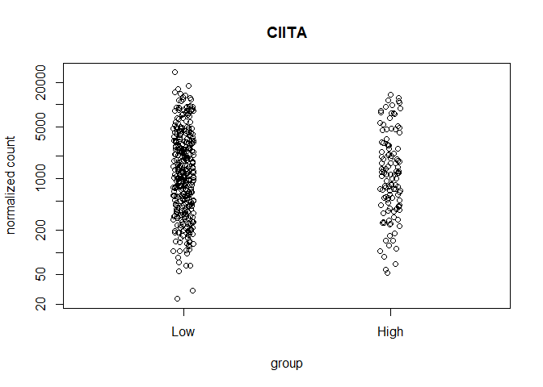<!-- -->

``` r
SKCM_all_results_filter <- as.data.frame(results(dds_all,cooksCutoff = T, name = "group_High_vs_Low")) %>% 
  dplyr::filter(baseMean >3000)
library(ggrepel)
SKCM_all_results_filter$gene <- rownames(SKCM_all_results_filter)
ggplot(SKCM_all_results_filter, aes(x = log2FoldChange, y = -log10(padj))) +
  geom_point(aes(color = ifelse(padj < 0.01 & abs(log2FoldChange) > 2, "significant", "non-significant")), alpha = 0.6, size=3) +
  geom_text_repel(
    aes(label = ifelse(padj < 0.01 & abs(log2FoldChange) > 2, as.character(gene), "")),
    size = 5,
    box.padding = unit(0.35, "lines"),
    point.padding = unit(0.5, "lines")
  ) +
  theme_minimal() +
  labs(title = "SKCM dataset - MHCII+ vs MHCII-",
       x = "Log2 Fold Change",
       y = "-log10(p-value)",
       color = "Gene Significance") +
  scale_color_manual(values = c("grey", "red"))
```

    ## Warning: ggrepel: 21 unlabeled data points (too many overlaps). Consider
    ## increasing max.overlaps

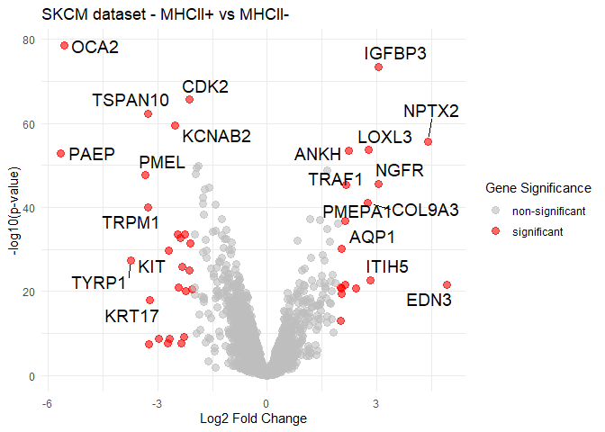<!-- -->

## GSEA

``` r
gene_list_skcm <- SKCM_all_results_filter$log2FoldChange
names(gene_list_skcm) <- SKCM_all_results_filter$gene
gene_list_skcm <- sort(gene_list_skcm, decreasing = TRUE)

msigdb_hallmark <- msigdbr(species = "Homo sapiens", category = "H")
```

    ## Warning: The `category` argument of `msigdbr()` is deprecated as of msigdbr 10.0.0.
    ## ℹ Please use the `collection` argument instead.
    ## This warning is displayed once per session.
    ## Call `lifecycle::last_lifecycle_warnings()` to see where this warning was
    ## generated.

``` r
msigdb_hallmark_list <- msigdb_hallmark[, c("gs_name", "gene_symbol")]

gsea_results_skcm <- GSEA(
  geneList = gene_list_skcm,           # Ranked gene list
  TERM2GENE = msigdb_hallmark_list,          # Hallmark gene sets in the correct format
  pvalueCutoff = 0.5,            # P-value cutoff for significance
  minGSSize = 10,                 # Minimum gene set size
  maxGSSize = 500,                # Maximum gene set size
  verbose = TRUE
)
```

    ## using 'fgsea' for GSEA analysis, please cite Korotkevich et al (2019).

    ## preparing geneSet collections...

    ## GSEA analysis...

    ## Warning in fgseaMultilevel(pathways = pathways, stats = stats, minSize =
    ## minSize, : For some of the pathways the P-values were likely overestimated. For
    ## such pathways log2err is set to NA.

    ## Warning in fgseaMultilevel(pathways = pathways, stats = stats, minSize =
    ## minSize, : For some pathways, in reality P-values are less than 1e-10. You can
    ## set the `eps` argument to zero for better estimation.

    ## leading edge analysis...

    ## done...

``` r
gsea_results_skcm@result$ID <- sub("HALLMARK_", replacement = "", x = gsea_results_skcm@result$ID)
gsea_results_skcm@result$regulation <- ifelse(gsea_results_skcm@result$NES > 0, "Upregulated", "Downregulated")
ggplot(subset(gsea_results_skcm@result,p.adjust<0.05), aes(x = reorder(ID, NES), y = NES)) +
  geom_bar(stat = "identity", aes(fill = regulation), width = 0.8) +
  geom_hline(yintercept = 0, linetype = "solid", color = "black") +
  scale_fill_manual(values = c("Upregulated" = "red", "Downregulated" = "blue")) +
  coord_flip() +  # Flip coordinates for better readability (pathways on the y-axis)
  theme_minimal() +
  labs(title = "GSEA Waterfall Plot - HLA+ vs HLA-",
       x = "Pathway",
       y = "Normalized Enrichment Score (NES)",
       fill = "Regulation") +
  theme(axis.text.y = element_text(size = 10, face = "bold"))  
```

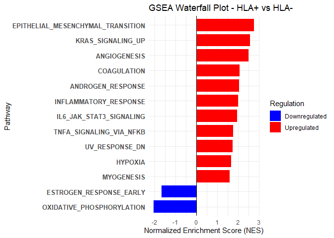<!-- -->

``` r
#performing progeny analysis as in the tcl data
allgenes <- unique(rownames(vst(dds_all)))
HLA_DR_genes <- grep("^HLA-DR", allgenes, value = T)
HLA_DP_genes <- grep("^HLA-DP", allgenes, value = T)
HLA_DQ_genes <- grep("^HLA-DQ", allgenes, value = T)
HLA_DO_genes <- grep("^HLA-DO", allgenes, value = T)
HLA_DM_genes <- grep("^HLA-DM", allgenes, value = T)
HLAII_genes <- unique(c("CIITA", "CD74", HLA_DR_genes,HLA_DP_genes,HLA_DQ_genes,HLA_DO_genes,HLA_DM_genes))
expr_skcm_norm <- assay(vst(dds_all))
expr_skcm_norm <- expr_skcm_norm[!(rownames(expr_skcm_norm) %in% HLAII_genes), , drop = FALSE]

activ_path <- progeny(expr_skcm_norm,
                    scale = TRUE,
                    organism = "Human",
                    top = 500,          # try 100–500 in sensitivity checks
                    perm = 300,           # no permutation; we’ll test with limma
                    return_assay = TRUE)


# 2) Differential pathway activity: HLA_high vs HLA_low (adjust for dataset)
clin_progeny = subset(clin_final, barcode %in% colnames(counts_hugo))
clin_progeny$group <- relevel(as.factor(clin_progeny$group),ref = "Low")
design <- model.matrix(~ group, data = clin_progeny)
fit <- lmFit(t(activ_path), design)            # pathways × samples -> transpose to samples × pathways
fit <- eBayes(fit)
progeny_res_skcm <- topTable(fit, coef = "groupHigh", number = Inf) %>%
  tibble::rownames_to_column("Pathway")

sig_skcm <- progeny_res_skcm %>% dplyr::filter(adj.P.Val < 0.05)
# logFC > 0 => higher activity in HLA_high
ggplot(sig_skcm, aes(x = reorder(Pathway, logFC), y = logFC, fill = logFC > 0)) +
  geom_col() + coord_flip() +
  scale_fill_manual(values = c(`TRUE` = "red", `FALSE` = "blue"), guide = "none") +
  labs(x = "Pathway", y = "Activity (logFC)", title = "PROGENy pathway activity: HLA+ vs HLA−")
```

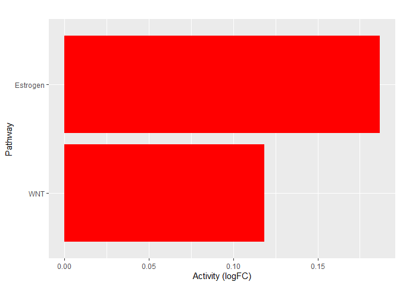<!-- -->

# Test dedifferentiation status vs signature in TCGA-SKCM (Exploratory, not included)

``` r
#check differentiation status on the TCGA biopsies

expr_mat <- as.matrix(assay(vst(dds_all)))
mode(expr_mat) <- "numeric"
# load gene sets and convert to list

melanoma_dediff <- read.csv("../public/Melanoma_dediff_gene_set.csv",
                            header = TRUE, stringsAsFactors = FALSE)

# Try to standardize column names
if (!all(c("term","gene") %in% names(melanoma_dediff))) {
  if (ncol(melanoma_dediff) >= 2) {
    colnames(melanoma_dediff)[1:2] <- c("gene","term")
    melanoma_dediff <- melanoma_dediff[, c("term","gene")]
  }
}

# Make a TERM -> vector-of-genes list
melanoma_sets <- split(melanoma_dediff$gene, melanoma_dediff$term)

# Keep only genes present in expr
genes_in_expr <- rownames(expr_skcm)
melanoma_sets <- lapply(melanoma_sets, function(g) intersect(unique(g), genes_in_expr))

# Drop any empty sets (no overlap)
melanoma_sets <- melanoma_sets[lengths(melanoma_sets) > 0]

# run ssGSEA with GSVA

# (Optional) de-duplicate genes if needed (keep the most variable probe/gene)
if (any(duplicated(rownames(expr_mat)))) {
  expr_mat <- expr_mat[!duplicated(rownames(expr_mat)), ]
}

gsparam <- ssgseaParam(exprData = expr_mat, geneSets = melanoma_sets)
ssgsea_scores <- GSVA::gsva(param = gsparam,verbose = TRUE)
```

    ## ℹ GSVA version 2.2.0

    ## ℹ Calculating  ssGSEA scores for 4 gene sets

    ## ℹ Calculating ranks

    ## ℹ Calculating rank weights

    ## ℹ Normalizing ssGSEA scores

    ## ✔ Calculations finished

``` r
# ssgsea_scores: matrix [pathways x samples]

# ---- 3) heatmap of ssGSEA scores per sample/cell line ----

preferred_order <- c("Melanocytic", "Transitory", "Neural_crest-like", "Undifferentiated")
row_order <- intersect(preferred_order, rownames(ssgsea_scores))
other_rows <- setdiff(rownames(ssgsea_scores), row_order)
ssgsea_scores <- ssgsea_scores[c(row_order, sort(other_rows)), , drop = FALSE]

# Row-scale to emphasize variation across samples (nice for visualization)
ssgsea_z <- t(scale(t(ssgsea_scores)))   # z-score per gene set (row)

# If you have sample annotations (e.g., cell line, HLA status), add here:
# sample_annot <- data.frame(
#   CellLine = ...,   # a vector named by colnames(expr_mat)
#   HLAclass = ...
# )
# rownames(sample_annot) <- colnames(ssgsea_z)
annots <- clin_final$group
names(annots) <- clin_final$sample
ann_colors <- list(
  HLA_status = c(
    Low        = "#0384fc",
    High   = "red"
  )
)

levels4 <- c("Low", "High")  
annot_df <- data.frame(
  HLA_status = factor(annots[colnames(ssgsea_z)], levels = levels4)
)
rownames(annot_df) <- colnames(ssgsea_z)

pheatmap(ssgsea_z,
         clustering_distance_rows = "euclidean",
         clustering_distance_cols = "euclidean",
         clustering_method = "complete",
         scale = "none",cutree_cols = 2,
         border_color = NA,color = viridis::inferno(100),
         main = "Enrichment of melanoma differentiation stages", annotation_col = annot_df,annotation_colors =ann_colors, 
         # annotation_col = sample_annot,   # uncomment if you created sample_annot
         fontsize_row = 10,
         fontsize_col = 8, show_colnames = F)
```

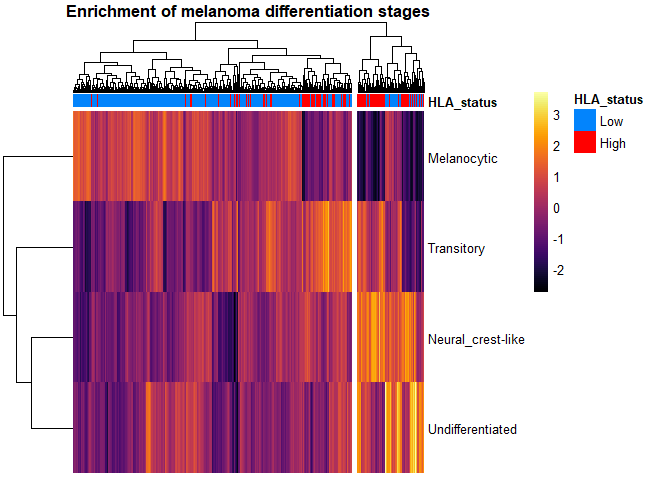<!-- -->

``` r
stopifnot(identical(rownames(annot_df), colnames(ssgsea_scores)))
grp <- droplevels(annot_df$HLA_status)          # e.g., c("Low","High")

# ---- 1) group means (pathways x groups) ----
G <- model.matrix(~ 0 + grp)                    # samples x groups (0/1)
colnames(G) <- levels(grp)
G_norm <- sweep(G, 2, colSums(G), "/")          # columns sum to 1
ssgsea_group_mean <- ssgsea_scores %*% G_norm   # pathways x groups (mean per group)

# ---- 2) row z-score of the group means (what you showed) ----
ssgsea_group_z <- t(scale(t(ssgsea_group_mean)))

# undiff_biopsies <- names(which(ssgsea_scores["Melanocytic",] > ssgsea_group_z["Melanocytic",]))
# 
# clin_final$undifferentiated <- ifelse(clin_final$sample %in% undiff_biopsies, "Undifferentiated", "Non-Undifferentiated")
# 
# fit_cox <- survfit(
#   Surv(DSS.time, DSS) ~ group,
#   rbind(subset(clin_final, undifferentiated == "Non-Undifferentiated" & group == "Low"),
#                subset(clin_final, group == "High"))
# )
# 
# # 5) Plot
# ggsurvplot(
#   fit_cox,
#   data       = clin_final,
#   pval       = TRUE,
#   risk.table = TRUE
# )

#now let's classify each with one state
states <- c("Melanocytic","Transitory","Neural_crest-like","Undifferentiated")
stopifnot(all(states %in% rownames(ssgsea_scores)))

# 1) row-z the four state scores (makes them comparable)
S      <- ssgsea_scores[states, , drop = FALSE]
S_z    <- t(scale(t(S)))              # rows = states, cols = samples

# 2) seed centroids by a quick max (only to initialize centroids)
seed_call <- apply(S_z, 2, function(x) states[which.max(x)])
centroids <- sapply(states, function(st) {
  idx <- which(seed_call == st)
  if (length(idx) < 3) {               # fallback if very few seeds
    # use the theoretical unit basis as a gentle prior
    u <- rep(0, length(states)); u[match(st, states)] <- 1
    return(u)
  }
  rowMeans(S_z[, idx, drop = FALSE])
})
# centroids is 4 (dims) x 4 (states), in the given order

# 3) build a smooth ordered curve through the centroids
t_knots <- 0:3                             # 0..3 correspond to the ordered states
sf_list <- lapply(1:4, function(d) splinefun(t_knots, centroids[d, ], method = "natural"))
curve_point <- function(t) vapply(sf_list, function(f) f(t), numeric(1))  # 4D point on curve

# 4) project each sample onto the curve (find t* minimizing distance)
proj_tau <- sapply(1:ncol(S_z), function(j) {
  x <- S_z[, j]
  f <- function(t) sum((x - curve_point(t))^2)
  stats::optimize(f, interval = c(0, 3))$minimum
})
tau <- proj_tau / 3                       # 0..1 pseudotime along M→T→NC→U

# 5) assign nearest phase; flag near-boundary as Ambiguous
knots     <- c(0, 1/3, 2/3, 1)
labels    <- states
nearest_k <- sapply(tau, function(t) which.min(abs(t - knots)))
call      <- labels[nearest_k]

# boundary margin (in tau units); 0.05 ≈ “within ~5% of the trajectory”
margin <- 0.1
is_boundary <- sapply(tau, function(t) min(abs(t - knots)) < margin)
call[is_boundary] <- paste0(call[is_boundary], " (ambiguous)")

# results
tsoi_call <- factor(call, levels = c(paste0(states, " (ambiguous)"), states))
names(tsoi_call) <- colnames(S_z)
tsoi_tau  <- setNames(tau, colnames(S_z))

# quick check: counts and ordering
table(tsoi_call)
```

    ## tsoi_call
    ##       Melanocytic (ambiguous)        Transitory (ambiguous) 
    ##                           153                            71 
    ## Neural_crest-like (ambiguous)  Undifferentiated (ambiguous) 
    ##                            46                            59 
    ##                   Melanocytic                    Transitory 
    ##                            49                            54 
    ##             Neural_crest-like              Undifferentiated 
    ##                            22                            17

``` r
# (optional) order samples by tau and plot the 4 rows as a heatmap
ord <- order(tsoi_tau)
ann <- data.frame(Tsoi_state = sub(" \\(ambiguous\\)", "", as.character(tsoi_call)))
rownames(ann) <- names(tsoi_tau)

pheatmap::pheatmap(
  S_z[, ord, drop = FALSE],
  cluster_rows = TRUE, cluster_cols = FALSE,
  gaps_col = cumsum(table(ann$Tsoi_state[ord])),
  annotation_col = ann,
  main = "Tsoi states (row-z) ordered by trajectory (tau)",
  show_colnames = FALSE
)
```

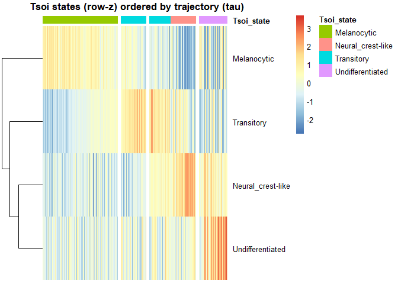<!-- -->

``` r
clin_final$Tsoi_state <- ann$Tsoi_state[match(rownames(ann), clin_final$sample)]

#add also the continuous variable
clin_final <- clin_final %>% mutate(Melanocytic = S_z["Melanocytic",clin_final$sample ])
clin_final <- clin_final %>% mutate(Transitory = S_z["Transitory",clin_final$sample ])
clin_final <- clin_final %>% mutate(Neural_crest_like = S_z["Neural_crest-like",clin_final$sample])
clin_final <- clin_final %>% mutate(Undifferentiated = S_z["Undifferentiated",clin_final$sample ])


states <- c("Melanocytic","Transitory","Neural_crest-like","Undifferentiated")
S      <- ssgsea_scores[states, , drop = FALSE]

# row-z if you want to equalize dynamic range
S_z <- t(scale(t(S)))

# Hard call as the max-scoring state
tsoi_call <- apply(S_z, 2, function(x) states[which.max(x)])

# Optional: "Mixed" if top two are too close
# tsoi_call2 <- apply(S_z, 2, function(x) {
#   ord <- order(x, decreasing = TRUE)
#   if ((x[ord[1]] - x[ord[2]]) < 0.2) return("Mixed")
#   states[ord[1]]
# })


clin_final$Tsoi_state <- tsoi_call[match(names(tsoi_call), clin_final$sample)]
```

## Multivariate model with Tsoi states

``` r
library(splines)
#Test with HLA-DRA, HLA-DPA1, HLA-DQA1
###HLA-DR
clin_final2$Melanocytic <- clin_final$Melanocytic[match(clin_final2$sample, clin_final$sample)]
clin_final2$Transitory <- clin_final$Transitory[match(clin_final2$sample, clin_final$sample)]
clin_final2$Neural_crest_like <- clin_final$Neural_crest_like[match(clin_final2$sample, clin_final$sample)]
clin_final2$Undifferentiated <- clin_final$Undifferentiated[match(clin_final2$sample, clin_final$sample)]

clin_final2$undifferentiated_score <- clin_final$undifferentiated_score[match(clin_final2$sample, clin_final$sample)]

clin_final2$Tsoi_state <- clin_final$Tsoi_state[match(clin_final2$sample, clin_final$sample)]

clin_final2 <- clin_final2 %>% 
  dplyr::mutate(Undifferentiated = case_when(
  Tsoi_state %in% c("Melanocytic", "Transitional", "Neural_crest-like") ~ "No",
  Tsoi_state %in% c("Undifferentiated") ~ "Yes"
))

clin_final2$Tsoi_state <- factor(clin_final2$Tsoi_state, levels = c(
  "Melanocytic", "Transitory", "Neural_crest-like","Undifferentiated")
)

# 2) Fit the Cox model with the new categorical vars
cox_mod <- coxph(
  Surv(DSS.time, DSS) ~ 
    HLA_const     + 
    Immune_infiltrate +
    group_DR +
    group_DP +
    group_DQ +
    Tsoi_state+
    Age_group   + 
    Sex      + 
    Stage_group,
  data = clin_final2
)

cox_mod_part <- coxph(
  Surv(DSS.time, DSS) ~ 
    HLA_const     + 
    Immune_infiltrate +
    Tsoi_state+
    Age_group   + 
    Sex      + 
    Stage_group,
  data = clin_final2
)
summary(cox_mod)
```

    ## Call:
    ## coxph(formula = Surv(DSS.time, DSS) ~ HLA_const + Immune_infiltrate + 
    ##     group_DR + group_DP + group_DQ + Tsoi_state + Age_group + 
    ##     Sex + Stage_group, data = clin_final2)
    ## 
    ##   n= 302, number of events= 133 
    ##    (11 observations deleted due to missingness)
    ## 
    ##                                 coef exp(coef) se(coef)      z Pr(>|z|)   
    ## HLA_constHigh               -0.68827   0.50244  0.23343 -2.949  0.00319 **
    ## Immune_infiltrateHigh       -0.42771   0.65200  0.32342 -1.322  0.18602   
    ## group_DRHigh                -0.80067   0.44903  0.31061 -2.578  0.00994 **
    ## group_DPHigh                -0.57392   0.56331  0.33416 -1.717  0.08589 . 
    ## group_DQHigh                 0.08067   1.08402  0.31571  0.256  0.79831   
    ## Tsoi_stateTransitory         0.45617   1.57801  0.21876  2.085  0.03705 * 
    ## Tsoi_stateNeural_crest-like -0.34692   0.70686  0.33523 -1.035  0.30073   
    ## Tsoi_stateUndifferentiated   0.55400   1.74021  0.28709  1.930  0.05364 . 
    ## Age_group≥40                 0.20664   1.22954  0.29243  0.707  0.47978   
    ## SexMALE                     -0.12245   0.88475  0.18898 -0.648  0.51703   
    ## Stage_groupIII               0.49181   1.63527  0.18947  2.596  0.00944 **
    ## Stage_groupIV                1.21030   3.35450  0.45367  2.668  0.00763 **
    ## ---
    ## Signif. codes:  0 '***' 0.001 '**' 0.01 '*' 0.05 '.' 0.1 ' ' 1
    ## 
    ##                             exp(coef) exp(-coef) lower .95 upper .95
    ## HLA_constHigh                  0.5024     1.9903    0.3180    0.7939
    ## Immune_infiltrateHigh          0.6520     1.5337    0.3459    1.2290
    ## group_DRHigh                   0.4490     2.2270    0.2443    0.8254
    ## group_DPHigh                   0.5633     1.7752    0.2926    1.0844
    ## group_DQHigh                   1.0840     0.9225    0.5838    2.0127
    ## Tsoi_stateTransitory           1.5780     0.6337    1.0278    2.4228
    ## Tsoi_stateNeural_crest-like    0.7069     1.4147    0.3664    1.3636
    ## Tsoi_stateUndifferentiated     1.7402     0.5746    0.9913    3.0547
    ## Age_group≥40                   1.2295     0.8133    0.6932    2.1810
    ## SexMALE                        0.8848     1.1303    0.6109    1.2814
    ## Stage_groupIII                 1.6353     0.6115    1.1280    2.3706
    ## Stage_groupIV                  3.3545     0.2981    1.3787    8.1619
    ## 
    ## Concordance= 0.691  (se = 0.025 )
    ## Likelihood ratio test= 60.13  on 12 df,   p=2e-08
    ## Wald test            = 50.5  on 12 df,   p=1e-06
    ## Score (logrank) test = 52.89  on 12 df,   p=4e-07

``` r
ggforest(cox_mod, data=clin_final2)
```

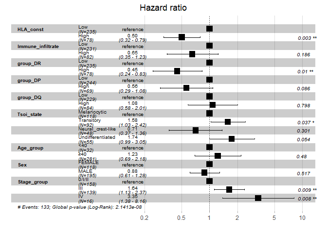<!-- -->

# Exploratory analyses on TIL Cohort

## Univariate analysis

``` r
# compute simple singscore
scores_til <- simpleScore(rank_data_til,
                      upSet   = up_list,
                      downSet = down_list)
rownames(scores_til) <- gsub(x= rownames(scores_til), pattern = "\\.", replacement = "-")
scores_til$sample <- rownames(scores_til)
scores_til <- subset(scores_til, sample %in% rownames(TIL_md_full))

clin_final_TIL <- subset(TIL_md_full, sample %in% scores_til$sample)
scores_til <- scores_til[order(scores_til$sample, clin_final_TIL$sample),]

clin_final_TIL$signature_score <- scores_til$TotalScore[
  match(clin_final_TIL$sample, scores_til$sample)
]

stopifnot(!any(is.na(clin_final_TIL$signature_score)))

clin_final_TIL <- clin_final_TIL %>% as.data.frame() %>%
  dplyr::mutate(group = if_else(signature_score >=
                           quantile(signature_score, 0.75),
                         "High","Low"))
clin_final_TIL <- clin_final_TIL %>% mutate(OS_event= case_when(
  OS_censored == 1 ~ 0,
  OS_censored == 0 ~ 1,
  TRUE ~ NA_integer_
))

clin_final_TIL <- clin_final_TIL %>% mutate(PFS_event= case_when(
  PFS_censored == 1 ~ 0,
  PFS_censored == 0 ~ 1,
  TRUE ~ NA_integer_
))

library(survival)
library(survminer)
# 4) Fit the survival model in one go, using the data frame
fit_cox_TIL <- survfit(
  Surv(OS.months, OS_event) ~ group,
  data = clin_final_TIL
)

# 5) Plot
 ggsurvplot(
  fit_cox_TIL,
  data       = clin_final_TIL,
  pval       = TRUE,
  risk.table = TRUE
)
```

    ## Ignoring unknown labels:
    ## • colour : "Strata"

<!-- -->

``` r
fit <- survfit(
  Surv(PFS.months, PFS_event) ~ group,
  data = clin_final_TIL
)

# 5) Plot
ggsurvplot(
  fit,
  data       = clin_final_TIL,
  pval       = TRUE,
  risk.table = TRUE
)
```

    ## Ignoring unknown labels:
    ## • colour : "Strata"

<!-- -->

# HLA-IICONST and response correlation in TIL (Exploratory, not included)

``` r
library(dplyr)

# 1) Define response
responders <- c("CR","PR","PR (NED)")
dat <- clin_final_TIL %>%
  dplyr::filter(!is.na(BOR)) %>%                       # drop missing outcome
  mutate(resp = BOR %in% responders,
         group = factor(group, levels = c("Low","High")))  # Low as reference

# 2) 2x2 table
tab <- table(dat$group, dat$resp)
tab
```

    ##       
    ##        FALSE TRUE
    ##   Low     20   10
    ##   High     6    5

``` r
#           resp
# group    FALSE TRUE
#  High        ?    ?
#  Low         ?    ?

# 3) Fisher's exact test (exact p-value) + odds ratio & 95% CI
ft <- fisher.test(tab)
ft
```

    ## 
    ##  Fisher's Exact Test for Count Data
    ## 
    ## data:  tab
    ## p-value = 0.4908
    ## alternative hypothesis: true odds ratio is not equal to 1
    ## 95 percent confidence interval:
    ##  0.3140483 8.4192485
    ## sample estimates:
    ## odds ratio 
    ##   1.645372

``` r
# ft$estimate is the odds ratio (High vs Low); ft$conf.int is the 95% CI

# 4) Equality of proportions (Wald/chi-square, gives CI for difference)
prop.test(x = tab[, "TRUE"], n = rowSums(tab), correct = FALSE)
```

    ## Warning in prop.test(x = tab[, "TRUE"], n = rowSums(tab), correct = FALSE):
    ## Chi-squared approximation may be incorrect

    ## 
    ##  2-sample test for equality of proportions without continuity correction
    ## 
    ## data:  tab[, "TRUE"] out of rowSums(tab)
    ## X-squared = 0.50971, df = 1, p-value = 0.4753
    ## alternative hypothesis: two.sided
    ## 95 percent confidence interval:
    ##  -0.4603870  0.2179628
    ## sample estimates:
    ##    prop 1    prop 2 
    ## 0.3333333 0.4545455

``` r
# 5) Unadjusted logistic regression (gives OR for High vs Low)
m0 <- glm(resp ~ group, family = binomial, data = dat)
summary(m0)
```

    ## 
    ## Call:
    ## glm(formula = resp ~ group, family = binomial, data = dat)
    ## 
    ## Coefficients:
    ##             Estimate Std. Error z value Pr(>|z|)  
    ## (Intercept)  -0.6931     0.3873  -1.790   0.0735 .
    ## groupHigh     0.5108     0.7188   0.711   0.4773  
    ## ---
    ## Signif. codes:  0 '***' 0.001 '**' 0.01 '*' 0.05 '.' 0.1 ' ' 1
    ## 
    ## (Dispersion parameter for binomial family taken to be 1)
    ## 
    ##     Null deviance: 53.850  on 40  degrees of freedom
    ## Residual deviance: 53.349  on 39  degrees of freedom
    ## AIC: 57.349
    ## 
    ## Number of Fisher Scoring iterations: 4

``` r
cbind(OR = exp(coef(m0)),
      confint.default(m0) |> exp())            # Wald CI; for small samples prefer exact/Firth
```

    ##                   OR     2.5 %   97.5 %
    ## (Intercept) 0.500000 0.2340459 1.068166
    ## groupHigh   1.666667 0.4073888 6.818493

``` r
# 7) Simple plot: proportion responders with Wilson 95% CI
library(ggplot2)
library(Hmisc)  # for binconf()
```

    ## 
    ## Attaching package: 'Hmisc'

    ## The following object is masked from 'package:e1071':
    ## 
    ##     impute

    ## The following object is masked from 'package:AnnotationDbi':
    ## 
    ##     contents

    ## The following objects are masked from 'package:dplyr':
    ## 
    ##     src, summarize

    ## The following object is masked from 'package:Biobase':
    ## 
    ##     contents

    ## The following objects are masked from 'package:base':
    ## 
    ##     format.pval, units

``` r
pp <- dat %>%
  group_by(group) %>%
  summarise(n = n(),
            r = sum(resp),
            prop = r / n,
            ci = list(Hmisc::binconf(r, n, method = "wilson")[1,2:3])) %>%
  tidyr::unnest_wider(ci, names_sep = "_")

dat <- dat %>% dplyr::mutate(Obj_res=case_when(
  BOR %in% c("CR", "PR", "PR (NED)") ~ "Response",
  BOR %in% c("PD", "SD") ~ "No response"
))

dat <- dat %>%
  dplyr::filter(!is.na(Obj_res)) %>%
  mutate(
    Obj_res = factor(Obj_res, levels = c("No response", "Response"))
  )

ggplot(dat, aes(x = Obj_res, y = signature_score)) +
  geom_boxplot(outlier.shape = NA, width = 0.6) +
  geom_jitter(width = 0.1, alpha = 0.6) +
  labs(
    x = NULL,
    y = "Scaled signature score",
    title = "Signature score in responders vs non-responders"
  ) +
  stat_compare_means(method = "wilcox.test")
```

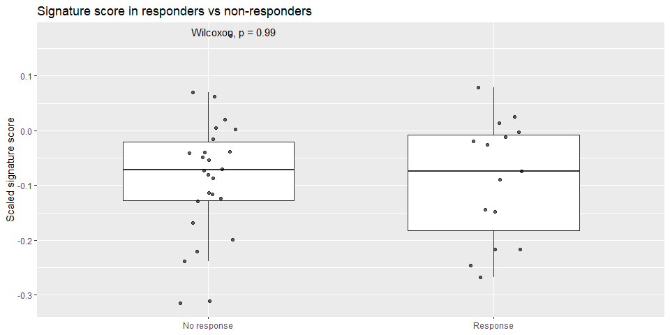<!-- -->

``` r
pp <- dat %>%
  group_by(group) %>%
  summarise(
    n  = n(),
    r  = sum(resp),
    prop = r / n,
    ci = list(Hmisc::binconf(r, n, method = "wilson")[1,2:3])
  ) %>%
  tidyr::unnest_wider(ci, names_sep = "_")  # ci_1, ci_2

ggplot(pp, aes(x = group, y = prop)) +
  geom_col() +
  geom_errorbar(aes(ymin = ci_Lower, ymax = ci_Upper), width = 0.15) +
  scale_y_continuous(labels = scales::percent_format()) +
  labs(
    x = "Signature group",
    y = "Response rate",
    title = "Response rate by signature group (95% Wilson CI)"
  )
```

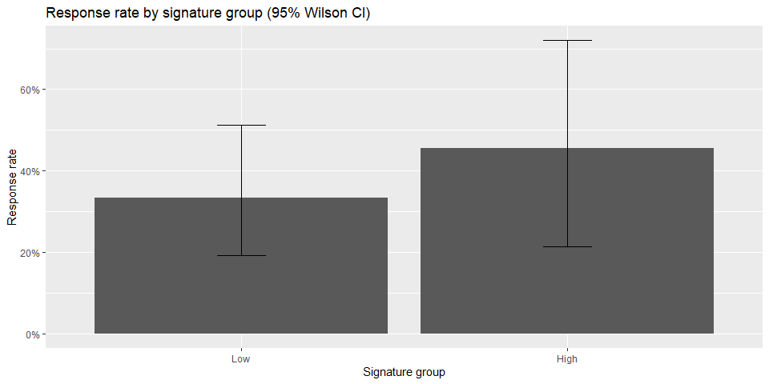<!-- -->

``` r
#Comparison among TCGA scores and TIL scores
combined <- bind_rows(
  clin_final_TIL %>%
    transmute(sample, signature_score,group, cohort = "TIL"),
  clin_final2 %>%
    transmute(sample, signature_score,group, cohort = "TCGA")
)
ggplot(combined, aes(x = signature_score, color = cohort)) +
  geom_density(linewidth = 2) +
  labs(x = "Signature score",
       y = "Density",
       title = "Distribution of signature score in TCGA vs trial")+
  theme_bw()
```

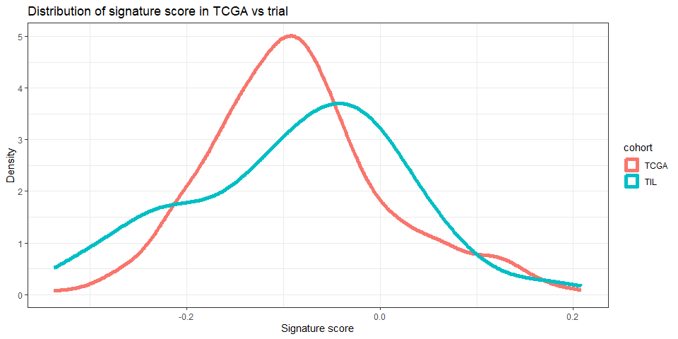<!-- -->

``` r
combined <- combined %>%
  group_by(cohort) %>%
  mutate(signature_z = as.numeric(scale(signature_score))) %>%
  ungroup()

ggplot(combined, aes(x = cohort, y = signature_z, colour = group)) +
   geom_violin(trim = FALSE) +
  geom_boxplot(position= position_dodge(0.9),width = 0.2, outlier.shape = NA) +
  geom_point(position = position_dodge(0.9), alpha = 0.5) +
  labs(x = NULL,
       y = "Signature score (z-score within cohort)",
       title = "Relative distribution of signature score")+
  geom_hline(yintercept = quantile(combined$signature_z, 0.75))
```

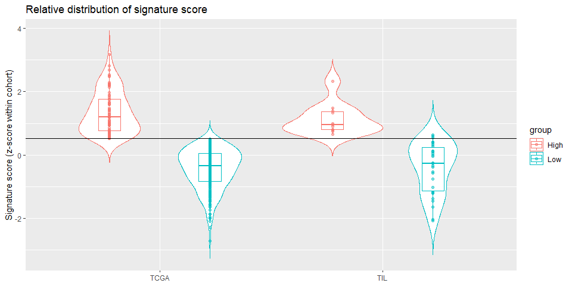<!-- -->

# TCR changes in HLA-high vs HLA-low (Exploratory, not included)

``` r
file <- "../controlled_data/TIL/immunarch_TRB/"
immdata <- repLoad(file)
```

    ## Warning: `repLoad()` was deprecated in immunarch 0.10.3.
    ## ℹ See `?immundata::read_repertoires()` for details on replacement functions.
    ## This warning is displayed once per session.
    ## Call `lifecycle::last_lifecycle_warnings()` to see where this warning was
    ## generated.

    ## 
    ## == Step 1/3: loading repertoire files... ==

    ## Processing "../controlled_data/TIL/immunarch_TRB/" ...

    ##   -- [1/40] Parsing "../controlled_data/TIL/immunarch_TRB/141303_Unknown_TRB.tsv" -- mixcr
    ## Rows: 3 Columns: 35── Column specification ────────────────────────────────────────────────────────
    ## Delimiter: "\t"
    ## chr (29): targetSequences, targetQualities, allVHitsWithScore, allDHitsWithS...
    ## dbl  (4): cloneId, readCount, readFraction, minQualCDR3
    ## lgl  (2): allCHitsWithScore, allCAlignments
    ## ℹ Use `spec()` to retrieve the full column specification for this data.
    ## ℹ Specify the column types or set `show_col_types = FALSE` to quiet this message.  -- [2/40] Parsing "../controlled_data/TIL/immunarch_TRB/141305_Unknown_TRB.tsv" -- mixcr
    ## Rows: 4 Columns: 35── Column specification ────────────────────────────────────────────────────────
    ## Delimiter: "\t"
    ## chr (30): targetSequences, targetQualities, allVHitsWithScore, allDHitsWithS...
    ## dbl  (4): cloneId, readCount, readFraction, minQualCDR3
    ## lgl  (1): allCAlignments
    ## ℹ Use `spec()` to retrieve the full column specification for this data.
    ## ℹ Specify the column types or set `show_col_types = FALSE` to quiet this message.  -- [3/40] Parsing "../controlled_data/TIL/immunarch_TRB/141306_Unknown_TRB.tsv" -- mixcr
    ## Rows: 120 Columns: 35── Column specification ────────────────────────────────────────────────────────
    ## Delimiter: "\t"
    ## chr (31): targetSequences, targetQualities, allVHitsWithScore, allDHitsWithS...
    ## dbl  (4): cloneId, readCount, readFraction, minQualCDR3
    ## ℹ Use `spec()` to retrieve the full column specification for this data.
    ## ℹ Specify the column types or set `show_col_types = FALSE` to quiet this message.  -- [4/40] Parsing "../controlled_data/TIL/immunarch_TRB/141308_Unknown_TRB.tsv" -- mixcr
    ## Rows: 2 Columns: 35── Column specification ────────────────────────────────────────────────────────
    ## Delimiter: "\t"
    ## chr (31): targetSequences, targetQualities, allVHitsWithScore, allDHitsWithS...
    ## dbl  (4): cloneId, readCount, readFraction, minQualCDR3
    ## ℹ Use `spec()` to retrieve the full column specification for this data.
    ## ℹ Specify the column types or set `show_col_types = FALSE` to quiet this message.  -- [5/40] Parsing "../controlled_data/TIL/immunarch_TRB/141310_Unknown_TRB.tsv" -- mixcr
    ## Rows: 5 Columns: 35── Column specification ────────────────────────────────────────────────────────
    ## Delimiter: "\t"
    ## chr (31): targetSequences, targetQualities, allVHitsWithScore, allDHitsWithS...
    ## dbl  (4): cloneId, readCount, readFraction, minQualCDR3
    ## ℹ Use `spec()` to retrieve the full column specification for this data.
    ## ℹ Specify the column types or set `show_col_types = FALSE` to quiet this message.  -- [6/40] Parsing "../controlled_data/TIL/immunarch_TRB/141311_Unknown_TRB.tsv" -- mixcr
    ## Rows: 14 Columns: 35── Column specification ────────────────────────────────────────────────────────
    ## Delimiter: "\t"
    ## chr (30): targetSequences, targetQualities, allVHitsWithScore, allDHitsWithS...
    ## dbl  (4): cloneId, readCount, readFraction, minQualCDR3
    ## lgl  (1): allCAlignments
    ## ℹ Use `spec()` to retrieve the full column specification for this data.
    ## ℹ Specify the column types or set `show_col_types = FALSE` to quiet this message.  -- [7/40] Parsing "../controlled_data/TIL/immunarch_TRB/141312_Unknown_TRB.tsv" -- mixcr
    ## Rows: 36 Columns: 35── Column specification ────────────────────────────────────────────────────────
    ## Delimiter: "\t"
    ## chr (31): targetSequences, targetQualities, allVHitsWithScore, allDHitsWithS...
    ## dbl  (4): cloneId, readCount, readFraction, minQualCDR3
    ## ℹ Use `spec()` to retrieve the full column specification for this data.
    ## ℹ Specify the column types or set `show_col_types = FALSE` to quiet this message.  -- [8/40] Parsing "../controlled_data/TIL/immunarch_TRB/141313_Unknown_TRB.tsv" -- mixcr
    ## Rows: 2 Columns: 35── Column specification ────────────────────────────────────────────────────────
    ## Delimiter: "\t"
    ## chr (31): targetSequences, targetQualities, allVHitsWithScore, allDHitsWithS...
    ## dbl  (4): cloneId, readCount, readFraction, minQualCDR3
    ## ℹ Use `spec()` to retrieve the full column specification for this data.
    ## ℹ Specify the column types or set `show_col_types = FALSE` to quiet this message.  -- [9/40] Parsing "../controlled_data/TIL/immunarch_TRB/141315_Unknown_TRB.tsv" -- mixcr
    ## Rows: 1 Columns: 35── Column specification ────────────────────────────────────────────────────────
    ## Delimiter: "\t"
    ## chr (30): targetSequences, targetQualities, allVHitsWithScore, allDHitsWithS...
    ## dbl  (4): cloneId, readCount, readFraction, minQualCDR3
    ## lgl  (1): allCAlignments
    ## ℹ Use `spec()` to retrieve the full column specification for this data.
    ## ℹ Specify the column types or set `show_col_types = FALSE` to quiet this message.  -- [10/40] Parsing "../controlled_data/TIL/immunarch_TRB/141323_Unknown_TRB.tsv" -- mixcr
    ## Rows: 20 Columns: 35── Column specification ────────────────────────────────────────────────────────
    ## Delimiter: "\t"
    ## chr (31): targetSequences, targetQualities, allVHitsWithScore, allDHitsWithS...
    ## dbl  (4): cloneId, readCount, readFraction, minQualCDR3
    ## ℹ Use `spec()` to retrieve the full column specification for this data.
    ## ℹ Specify the column types or set `show_col_types = FALSE` to quiet this message.  -- [11/40] Parsing "../controlled_data/TIL/immunarch_TRB/141401_Unknown_TRB.tsv" -- mixcr
    ## Rows: 49 Columns: 35── Column specification ────────────────────────────────────────────────────────
    ## Delimiter: "\t"
    ## chr (31): targetSequences, targetQualities, allVHitsWithScore, allDHitsWithS...
    ## dbl  (4): cloneId, readCount, readFraction, minQualCDR3
    ## ℹ Use `spec()` to retrieve the full column specification for this data.
    ## ℹ Specify the column types or set `show_col_types = FALSE` to quiet this message.  -- [12/40] Parsing "../controlled_data/TIL/immunarch_TRB/141402_Unknown_TRB.tsv" -- mixcr
    ## Rows: 194 Columns: 35── Column specification ────────────────────────────────────────────────────────
    ## Delimiter: "\t"
    ## chr (31): targetSequences, targetQualities, allVHitsWithScore, allDHitsWithS...
    ## dbl  (4): cloneId, readCount, readFraction, minQualCDR3
    ## ℹ Use `spec()` to retrieve the full column specification for this data.
    ## ℹ Specify the column types or set `show_col_types = FALSE` to quiet this message.  -- [13/40] Parsing "../controlled_data/TIL/immunarch_TRB/141404_Unknown_TRB.tsv" -- mixcr
    ## Rows: 25 Columns: 35── Column specification ────────────────────────────────────────────────────────
    ## Delimiter: "\t"
    ## chr (31): targetSequences, targetQualities, allVHitsWithScore, allDHitsWithS...
    ## dbl  (4): cloneId, readCount, readFraction, minQualCDR3
    ## ℹ Use `spec()` to retrieve the full column specification for this data.
    ## ℹ Specify the column types or set `show_col_types = FALSE` to quiet this message.  -- [14/40] Parsing "../controlled_data/TIL/immunarch_TRB/141405_Unknown_TRB.tsv" -- mixcr
    ## Rows: 120 Columns: 35── Column specification ────────────────────────────────────────────────────────
    ## Delimiter: "\t"
    ## chr (31): targetSequences, targetQualities, allVHitsWithScore, allDHitsWithS...
    ## dbl  (4): cloneId, readCount, readFraction, minQualCDR3
    ## ℹ Use `spec()` to retrieve the full column specification for this data.
    ## ℹ Specify the column types or set `show_col_types = FALSE` to quiet this message.  -- [15/40] Parsing "../controlled_data/TIL/immunarch_TRB/141406_Unknown_TRB.tsv" -- mixcr
    ## Rows: 10 Columns: 35── Column specification ────────────────────────────────────────────────────────
    ## Delimiter: "\t"
    ## chr (31): targetSequences, targetQualities, allVHitsWithScore, allDHitsWithS...
    ## dbl  (4): cloneId, readCount, readFraction, minQualCDR3
    ## ℹ Use `spec()` to retrieve the full column specification for this data.
    ## ℹ Specify the column types or set `show_col_types = FALSE` to quiet this message.  -- [16/40] Parsing "../controlled_data/TIL/immunarch_TRB/141407_Unknown_TRB.tsv" -- mixcr
    ## Rows: 115 Columns: 35── Column specification ────────────────────────────────────────────────────────
    ## Delimiter: "\t"
    ## chr (31): targetSequences, targetQualities, allVHitsWithScore, allDHitsWithS...
    ## dbl  (4): cloneId, readCount, readFraction, minQualCDR3
    ## ℹ Use `spec()` to retrieve the full column specification for this data.
    ## ℹ Specify the column types or set `show_col_types = FALSE` to quiet this message.  -- [17/40] Parsing "../controlled_data/TIL/immunarch_TRB/141409_Unknown_TRB.tsv" -- mixcr
    ## Rows: 14 Columns: 35── Column specification ────────────────────────────────────────────────────────
    ## Delimiter: "\t"
    ## chr (31): targetSequences, targetQualities, allVHitsWithScore, allDHitsWithS...
    ## dbl  (4): cloneId, readCount, readFraction, minQualCDR3
    ## ℹ Use `spec()` to retrieve the full column specification for this data.
    ## ℹ Specify the column types or set `show_col_types = FALSE` to quiet this message.  -- [18/40] Parsing "../controlled_data/TIL/immunarch_TRB/141410_Unknown_TRB.tsv" -- mixcr
    ## Rows: 46 Columns: 35── Column specification ────────────────────────────────────────────────────────
    ## Delimiter: "\t"
    ## chr (31): targetSequences, targetQualities, allVHitsWithScore, allDHitsWithS...
    ## dbl  (4): cloneId, readCount, readFraction, minQualCDR3
    ## ℹ Use `spec()` to retrieve the full column specification for this data.
    ## ℹ Specify the column types or set `show_col_types = FALSE` to quiet this message.  -- [19/40] Parsing "../controlled_data/TIL/immunarch_TRB/141411_Unknown_TRB.tsv" -- mixcr
    ## Rows: 103 Columns: 35── Column specification ────────────────────────────────────────────────────────
    ## Delimiter: "\t"
    ## chr (31): targetSequences, targetQualities, allVHitsWithScore, allDHitsWithS...
    ## dbl  (4): cloneId, readCount, readFraction, minQualCDR3
    ## ℹ Use `spec()` to retrieve the full column specification for this data.
    ## ℹ Specify the column types or set `show_col_types = FALSE` to quiet this message.  -- [20/40] Parsing "../controlled_data/TIL/immunarch_TRB/141412_Unknown_TRB.tsv" -- mixcr
    ## Rows: 66 Columns: 35── Column specification ────────────────────────────────────────────────────────
    ## Delimiter: "\t"
    ## chr (31): targetSequences, targetQualities, allVHitsWithScore, allDHitsWithS...
    ## dbl  (4): cloneId, readCount, readFraction, minQualCDR3
    ## ℹ Use `spec()` to retrieve the full column specification for this data.
    ## ℹ Specify the column types or set `show_col_types = FALSE` to quiet this message.  -- [21/40] Parsing "../controlled_data/TIL/immunarch_TRB/141413_Unknown_TRB.tsv" -- mixcr
    ## Rows: 46 Columns: 35── Column specification ────────────────────────────────────────────────────────
    ## Delimiter: "\t"
    ## chr (31): targetSequences, targetQualities, allVHitsWithScore, allDHitsWithS...
    ## dbl  (4): cloneId, readCount, readFraction, minQualCDR3
    ## ℹ Use `spec()` to retrieve the full column specification for this data.
    ## ℹ Specify the column types or set `show_col_types = FALSE` to quiet this message.  -- [22/40] Parsing "../controlled_data/TIL/immunarch_TRB/909_14_Baseline_TRB.tsv" -- mixcr
    ## Rows: 51 Columns: 35── Column specification ────────────────────────────────────────────────────────
    ## Delimiter: "\t"
    ## chr (31): targetSequences, targetQualities, allVHitsWithScore, allDHitsWithS...
    ## dbl  (4): cloneId, readCount, readFraction, minQualCDR3
    ## ℹ Use `spec()` to retrieve the full column specification for this data.
    ## ℹ Specify the column types or set `show_col_types = FALSE` to quiet this message.  -- [23/40] Parsing "../controlled_data/TIL/immunarch_TRB/909_15_Progression_TRB.tsv" -- mixcr
    ## Rows: 18 Columns: 35── Column specification ────────────────────────────────────────────────────────
    ## Delimiter: "\t"
    ## chr (30): targetSequences, targetQualities, allVHitsWithScore, allDHitsWithS...
    ## dbl  (4): cloneId, readCount, readFraction, minQualCDR3
    ## lgl  (1): allCAlignments
    ## ℹ Use `spec()` to retrieve the full column specification for this data.
    ## ℹ Specify the column types or set `show_col_types = FALSE` to quiet this message.  -- [24/40] Parsing "../controlled_data/TIL/immunarch_TRB/909_17_Baseline_TRB.tsv" -- mixcr
    ## Rows: 14 Columns: 35── Column specification ────────────────────────────────────────────────────────
    ## Delimiter: "\t"
    ## chr (30): targetSequences, targetQualities, allVHitsWithScore, allDHitsWithS...
    ## dbl  (4): cloneId, readCount, readFraction, minQualCDR3
    ## lgl  (1): allCAlignments
    ## ℹ Use `spec()` to retrieve the full column specification for this data.
    ## ℹ Specify the column types or set `show_col_types = FALSE` to quiet this message.  -- [25/40] Parsing "../controlled_data/TIL/immunarch_TRB/909_22_2_aftIPI_befTIL_Unknown_TRB.tsv" -- mixcr
    ## Rows: 70 Columns: 35── Column specification ────────────────────────────────────────────────────────
    ## Delimiter: "\t"
    ## chr (31): targetSequences, targetQualities, allVHitsWithScore, allDHitsWithS...
    ## dbl  (4): cloneId, readCount, readFraction, minQualCDR3
    ## ℹ Use `spec()` to retrieve the full column specification for this data.
    ## ℹ Specify the column types or set `show_col_types = FALSE` to quiet this message.  -- [26/40] Parsing "../controlled_data/TIL/immunarch_TRB/909_25_Baseline_TRB.tsv" -- mixcr
    ## Rows: 38 Columns: 35── Column specification ────────────────────────────────────────────────────────
    ## Delimiter: "\t"
    ## chr (31): targetSequences, targetQualities, allVHitsWithScore, allDHitsWithS...
    ## dbl  (4): cloneId, readCount, readFraction, minQualCDR3
    ## ℹ Use `spec()` to retrieve the full column specification for this data.
    ## ℹ Specify the column types or set `show_col_types = FALSE` to quiet this message.  -- [27/40] Parsing "../controlled_data/TIL/immunarch_TRB/909_26_Baseline_TRB.tsv" -- mixcr
    ## Rows: 99 Columns: 35── Column specification ────────────────────────────────────────────────────────
    ## Delimiter: "\t"
    ## chr (31): targetSequences, targetQualities, allVHitsWithScore, allDHitsWithS...
    ## dbl  (4): cloneId, readCount, readFraction, minQualCDR3
    ## ℹ Use `spec()` to retrieve the full column specification for this data.
    ## ℹ Specify the column types or set `show_col_types = FALSE` to quiet this message.  -- [28/40] Parsing "../controlled_data/TIL/immunarch_TRB/909_27_Baseline_TRB.tsv" -- mixcr
    ## Rows: 2 Columns: 35── Column specification ────────────────────────────────────────────────────────
    ## Delimiter: "\t"
    ## chr (30): targetSequences, targetQualities, allVHitsWithScore, allDHitsWithS...
    ## dbl  (4): cloneId, readCount, readFraction, minQualCDR3
    ## lgl  (1): allCAlignments
    ## ℹ Use `spec()` to retrieve the full column specification for this data.
    ## ℹ Specify the column types or set `show_col_types = FALSE` to quiet this message.  -- [29/40] Parsing "../controlled_data/TIL/immunarch_TRB/909_29_Baseline_TRB.tsv" -- mixcr
    ## Rows: 351 Columns: 35── Column specification ────────────────────────────────────────────────────────
    ## Delimiter: "\t"
    ## chr (31): targetSequences, targetQualities, allVHitsWithScore, allDHitsWithS...
    ## dbl  (4): cloneId, readCount, readFraction, minQualCDR3
    ## ℹ Use `spec()` to retrieve the full column specification for this data.
    ## ℹ Specify the column types or set `show_col_types = FALSE` to quiet this message.  -- [30/40] Parsing "../controlled_data/TIL/immunarch_TRB/909_31_Baseline_TRB.tsv" -- mixcr
    ## Rows: 63 Columns: 35── Column specification ────────────────────────────────────────────────────────
    ## Delimiter: "\t"
    ## chr (31): targetSequences, targetQualities, allVHitsWithScore, allDHitsWithS...
    ## dbl  (4): cloneId, readCount, readFraction, minQualCDR3
    ## ℹ Use `spec()` to retrieve the full column specification for this data.
    ## ℹ Specify the column types or set `show_col_types = FALSE` to quiet this message.  -- [31/40] Parsing "../controlled_data/TIL/immunarch_TRB/909_34_Progression_TRB.tsv" -- mixcr
    ## Rows: 28 Columns: 35── Column specification ────────────────────────────────────────────────────────
    ## Delimiter: "\t"
    ## chr (31): targetSequences, targetQualities, allVHitsWithScore, allDHitsWithS...
    ## dbl  (4): cloneId, readCount, readFraction, minQualCDR3
    ## ℹ Use `spec()` to retrieve the full column specification for this data.
    ## ℹ Specify the column types or set `show_col_types = FALSE` to quiet this message.  -- [32/40] Parsing "../controlled_data/TIL/immunarch_TRB/909_35_Progression_TRB.tsv" -- mixcr
    ## Rows: 19 Columns: 35── Column specification ────────────────────────────────────────────────────────
    ## Delimiter: "\t"
    ## chr (31): targetSequences, targetQualities, allVHitsWithScore, allDHitsWithS...
    ## dbl  (4): cloneId, readCount, readFraction, minQualCDR3
    ## ℹ Use `spec()` to retrieve the full column specification for this data.
    ## ℹ Specify the column types or set `show_col_types = FALSE` to quiet this message.  -- [33/40] Parsing "../controlled_data/TIL/immunarch_TRB/909_36_Baseline_TRB.tsv" -- mixcr
    ## Rows: 167 Columns: 35── Column specification ────────────────────────────────────────────────────────
    ## Delimiter: "\t"
    ## chr (31): targetSequences, targetQualities, allVHitsWithScore, allDHitsWithS...
    ## dbl  (4): cloneId, readCount, readFraction, minQualCDR3
    ## ℹ Use `spec()` to retrieve the full column specification for this data.
    ## ℹ Specify the column types or set `show_col_types = FALSE` to quiet this message.  -- [34/40] Parsing "../controlled_data/TIL/immunarch_TRB/909_37_Baseline_TRB.tsv" -- mixcr
    ## Rows: 228 Columns: 35── Column specification ────────────────────────────────────────────────────────
    ## Delimiter: "\t"
    ## chr (31): targetSequences, targetQualities, allVHitsWithScore, allDHitsWithS...
    ## dbl  (4): cloneId, readCount, readFraction, minQualCDR3
    ## ℹ Use `spec()` to retrieve the full column specification for this data.
    ## ℹ Specify the column types or set `show_col_types = FALSE` to quiet this message.  -- [35/40] Parsing "../controlled_data/TIL/immunarch_TRB/909_40_Baseline_TRB.tsv" -- mixcr
    ## Rows: 109 Columns: 35── Column specification ────────────────────────────────────────────────────────
    ## Delimiter: "\t"
    ## chr (31): targetSequences, targetQualities, allVHitsWithScore, allDHitsWithS...
    ## dbl  (4): cloneId, readCount, readFraction, minQualCDR3
    ## ℹ Use `spec()` to retrieve the full column specification for this data.
    ## ℹ Specify the column types or set `show_col_types = FALSE` to quiet this message.  -- [36/40] Parsing "../controlled_data/TIL/immunarch_TRB/909_42_Baseline_TRB.tsv" -- mixcr
    ## Rows: 154 Columns: 35── Column specification ────────────────────────────────────────────────────────
    ## Delimiter: "\t"
    ## chr (31): targetSequences, targetQualities, allVHitsWithScore, allDHitsWithS...
    ## dbl  (4): cloneId, readCount, readFraction, minQualCDR3
    ## ℹ Use `spec()` to retrieve the full column specification for this data.
    ## ℹ Specify the column types or set `show_col_types = FALSE` to quiet this message.  -- [37/40] Parsing "../controlled_data/TIL/immunarch_TRB/909_43_Baseline_TRB.tsv" -- mixcr
    ## Rows: 8 Columns: 35── Column specification ────────────────────────────────────────────────────────
    ## Delimiter: "\t"
    ## chr (31): targetSequences, targetQualities, allVHitsWithScore, allDHitsWithS...
    ## dbl  (4): cloneId, readCount, readFraction, minQualCDR3
    ## ℹ Use `spec()` to retrieve the full column specification for this data.
    ## ℹ Specify the column types or set `show_col_types = FALSE` to quiet this message.  -- [38/40] Parsing "../controlled_data/TIL/immunarch_TRB/909_45_Baseline_TRB.tsv" -- mixcr
    ## Rows: 524 Columns: 35── Column specification ────────────────────────────────────────────────────────
    ## Delimiter: "\t"
    ## chr (31): targetSequences, targetQualities, allVHitsWithScore, allDHitsWithS...
    ## dbl  (4): cloneId, readCount, readFraction, minQualCDR3
    ## ℹ Use `spec()` to retrieve the full column specification for this data.
    ## ℹ Specify the column types or set `show_col_types = FALSE` to quiet this message.  -- [39/40] Parsing "../controlled_data/TIL/immunarch_TRB/909_46_Baseline_TRB.tsv" -- mixcr
    ## Rows: 58 Columns: 35── Column specification ────────────────────────────────────────────────────────
    ## Delimiter: "\t"
    ## chr (31): targetSequences, targetQualities, allVHitsWithScore, allDHitsWithS...
    ## dbl  (4): cloneId, readCount, readFraction, minQualCDR3
    ## ℹ Use `spec()` to retrieve the full column specification for this data.
    ## ℹ Specify the column types or set `show_col_types = FALSE` to quiet this message.  -- [40/40] Parsing "../controlled_data/TIL/immunarch_TRB/metadata.txt" -- metadata
    ## 
    ## == Step 2/3: checking metadata files and merging files... ==
    ## 
    ## Processing "../controlled_data/TIL/immunarch_TRB/" ...
    ##   -- Everything is OK!
    ## 
    ## == Step 3/3: processing paired chain data... ==
    ## 
    ## Done!

``` r
exp_vol <- repExplore(immdata$data, .method = "volume",.coding = T)
```

    ## Warning: `repExplore()` was deprecated in immunarch 0.10.3.
    ## ℹ Run `?airr_desc()` for information on new functions.
    ## This warning is displayed once per session.
    ## Call `lifecycle::last_lifecycle_warnings()` to see where this warning was
    ## generated.

``` r
immdata$meta$Patient <- gsub("_", "", immdata$meta$Patient_Raw) 
immdata$meta$Patient <- gsub("2T1", "", immdata$meta$Patient) 
immdata$meta$Patient <- gsub("beforeTILs", "", immdata$meta$Patient) 
immdata$meta$Patient <- gsub("2aftIPIbefTIL", "", immdata$meta$Patient) 

immdata$meta <- immdata$meta %>% left_join(clin_final_TIL, by = "Patient")

vis(exp_vol, .by = c("group"), .meta = immdata$meta)
```

    ## Warning in ggpubr::geom_signif(data = p_df, aes(xmin = group1, xmax = group2, :
    ## Ignoring unknown aesthetics: xmin, xmax, annotations, and y_position

    ## Warning: The `size` argument of `element_line()` is deprecated as of ggplot2 3.4.0.
    ## ℹ Please use the `linewidth` argument instead.
    ## ℹ The deprecated feature was likely used in the immunarch package.
    ##   Please report the issue at <https://github.com/immunomind/immunarch/issues>.
    ## This warning is displayed once per session.
    ## Call `lifecycle::last_lifecycle_warnings()` to see where this warning was
    ## generated.

    ## Warning: The `size` argument of `element_rect()` is deprecated as of ggplot2 3.4.0.
    ## ℹ Please use the `linewidth` argument instead.
    ## ℹ The deprecated feature was likely used in the immunarch package.
    ##   Please report the issue at <https://github.com/immunomind/immunarch/issues>.
    ## This warning is displayed once per session.
    ## Call `lifecycle::last_lifecycle_warnings()` to see where this warning was
    ## generated.

<!-- -->

``` r
save(clin_final_TIL, file = "../controlled_data/TIL/clin_final_TIL.R")
save(clin_final, file = "../controlled_data/TIL/clin_final.R")
```
